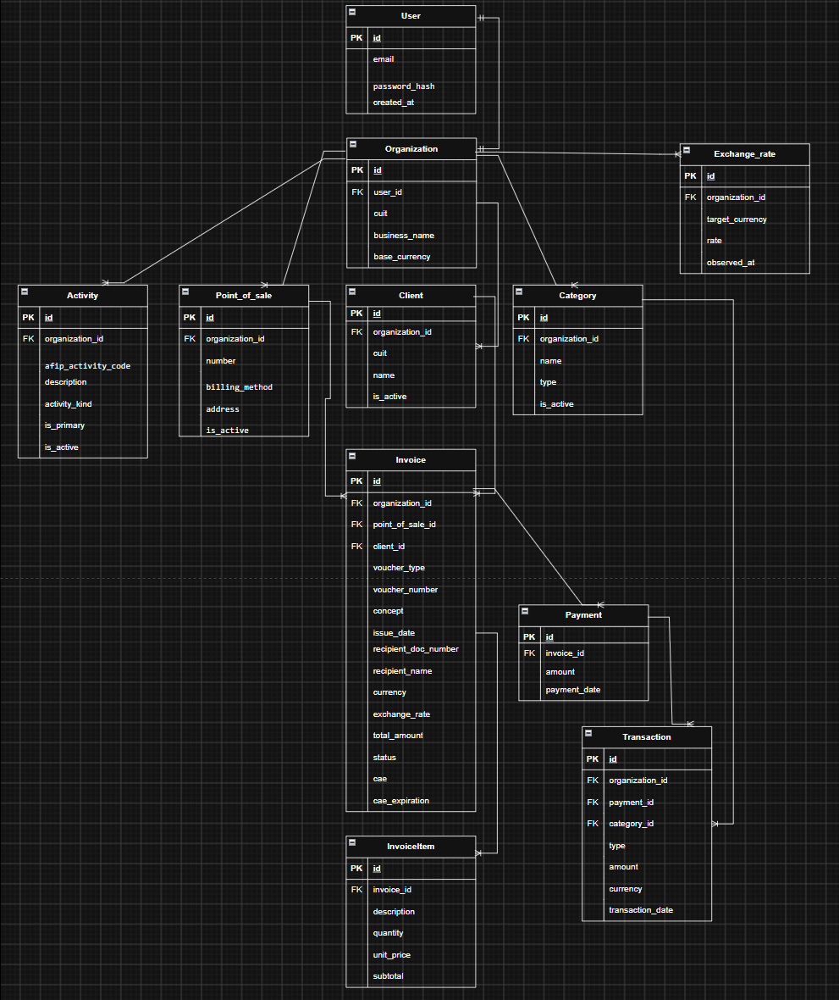

# Propuesta de proyecto — Primera Entrega (versión corregida)

> **Trabajo Final Integrador** — Tecnicatura Universitaria en Programación, UTN
> **Sistema Web de Gestión Financiera y Facturación Electrónica**

| | |
| --- | --- |
| **Tipo de proyecto** | Aplicación web |
| **Modalidad** | Trabajo Final Integrador |
| **Estado** | Primera Entrega — propuesta corregida según la devolución docente |
| **Fecha** | Agosto de 2026 (corregida en septiembre de 2026) |
| **Repositorio** | <https://github.com/juanpiRiv/TFI-UTN-TUPAD> |

**Integrantes:** Rivero Albornoz, Juan Pablo · Rios, Brian Emanuel · Riveros Valgañón, Nahuel Nicolás

> Este documento reemplaza al PDF original ([`TFI_Primera_Entrega.pdf`](./TFI_Primera_Entrega.pdf), que se conserva como histórico). Por indicación docente, la documentación del proyecto se mantiene en Markdown dentro del repositorio.

## Índice

1. [Resumen ejecutivo](#1-resumen-ejecutivo)
2. [Problema identificado](#2-problema-identificado)
3. [Solución propuesta](#3-solución-propuesta)
4. [Objetivo general y objetivos específicos](#4-objetivo-general-y-objetivos-específicos)
5. [Usuarios objetivo](#5-usuarios-objetivo)
6. [Propuesta de valor](#6-propuesta-de-valor)
7. [Alcance del proyecto — MVP](#7-alcance-del-proyecto--mvp)
8. [Funcionalidades fuera del MVP](#8-funcionalidades-fuera-del-mvp)
9. [Stack tecnológico](#9-stack-tecnológico)
10. [Arquitectura propuesta](#10-arquitectura-propuesta)
11. [Descripción de los módulos principales](#11-descripción-de-los-módulos-principales)
12. [Modelo conceptual de datos](#12-modelo-conceptual-de-datos)
13. [Requerimientos funcionales](#13-requerimientos-funcionales)
14. [Requerimientos no funcionales](#14-requerimientos-no-funcionales)
15. [Reglas de negocio](#15-reglas-de-negocio)
16. [Gestión del proyecto y repositorio](#16-gestión-del-proyecto-y-repositorio)
17. [Roadmap](#17-roadmap-del-proyecto)
18. [Riesgos y mitigación](#18-riesgos-y-mitigación)
19. [Criterios de éxito](#19-criterios-de-éxito)
20. [Conclusión](#20-conclusión)

---

## 1. Resumen ejecutivo

El proyecto propone desarrollar una plataforma web de gestión financiera y facturación electrónica orientada inicialmente a **monotributistas que venden productos, prestan servicios o realizan ambas actividades**. Desde una única interfaz, el usuario podrá registrar ingresos y egresos, administrar clientes, categorizar operaciones, visualizar indicadores financieros, trabajar con diferentes monedas y emitir comprobantes electrónicos mediante integración con ARCA. El sistema también incorporará cotizaciones actualizadas a través de las APIs oficiales del Banco Central de la República Argentina.

Como evolución del producto, se contempla consultar la Central de Deudores del BCRA e integrar WhatsApp mediante Kapso para el envío de facturas, notificaciones y recordatorios a clientes.

## 2. Problema identificado

Muchos **monotributistas** realizan cotidianamente tareas relacionadas con:

- Registro de ingresos y gastos
- Facturación electrónica
- Control de pagos y cobros
- Administración de clientes
- Consulta de cotizaciones de moneda extranjera
- Comunicación con clientes

Sin embargo, cada una de estas tareas se realiza con una herramienta diferente: ARCA para emitir facturas, una hoja de cálculo para registrar ingresos, otro sitio para consultar el tipo de cambio y WhatsApp para comunicarse con clientes.

Esta fragmentación genera los siguientes problemas:

- Duplicación de información entre herramientas
- Registros inconsistentes o desactualizados
- Pérdida de tiempo en tareas repetitivas
- Dificultad para conocer el resultado de gestión o de caja del período
- Escasa trazabilidad de las operaciones
- Mayor probabilidad de errores administrativos

## 3. Solución propuesta

Se desarrollará una aplicación web que funcione como centro de gestión financiera y facturación para monotributistas. La plataforma permitirá realizar en un único lugar todo lo que hoy requiere varias herramientas:

- Administrar clientes y su historial comercial
- Registrar y categorizar ingresos y egresos
- Consultar el estado de gestión mediante un dashboard interactivo
- Trabajar con múltiples monedas con consulta automática de cotizaciones
- Emitir comprobantes electrónicos integrados con ARCA
- Registrar pagos y diferenciar lo facturado de lo efectivamente cobrado
- Generar reportes de gestión del período

**Integraciones externas principales:**

| Servicio | Función |
| --- | --- |
| ARCA | Facturación electrónica — obtención de CAE |
| BCRA | Información cambiaria y financiera pública |
| Kapso / WhatsApp | Comunicación automatizada con clientes (fase evolutiva) |

## 4. Objetivo general y objetivos específicos

### Objetivo general

Desarrollar una plataforma web que centralice la gestión financiera y la facturación electrónica de monotributistas que venden productos y/o prestan servicios, integrando información propia del usuario con servicios externos oficiales y herramientas de comunicación.

### Objetivos específicos

- Permitir registrar y clasificar ingresos y egresos.
- Facilitar la administración de clientes y su historial.
- Mostrar indicadores que reflejen el resultado de gestión y el estado de los movimientos registrados.
- Soportar operaciones en múltiples monedas conservando el tipo de cambio histórico.
- Consultar automáticamente cotizaciones mediante la API oficial del BCRA.
- Emitir comprobantes electrónicos mediante integración con ARCA (WSFEv1).
- Vincular facturas emitidas con los movimientos financieros correspondientes.
- Implementar autenticación y mecanismos básicos de seguridad.
- Diseñar una arquitectura extensible para incorporar nuevas integraciones.
- Desplegar la solución utilizando servicios en la nube.

## 5. Usuarios objetivo

El perfil prioritario para el P0 serán **monotributistas que desarrollan actividades independientes, ya sea mediante la prestación de servicios, la venta de productos o una combinación de ambas**.

El sistema estará orientado inicialmente a ayudarlos a gestionar clientes, ingresos, egresos, facturación y cobros desde una única plataforma.

En esta primera versión no se incluirá gestión de inventario, control de stock ni e-commerce. Otros perfiles y funcionalidades podrán incorporarse en etapas posteriores.

La elección de este perfil será validada mediante un relevamiento breve con usuarios reales.

## 6. Propuesta de valor

El diferencial del producto radica en reunir dentro de una misma plataforma información financiera interna del negocio e información obtenida desde servicios externos oficiales. El usuario pasa de trabajar con múltiples herramientas desconectadas a operar desde un único entorno que integra tres áreas:

| Gestión | Información | Automatización |
| --- | --- | --- |
| Clientes · Ingresos | BCRA · Cotizaciones | ARCA · Facturación |
| Egresos · Facturas | Central de Deudores | WhatsApp · Kapso |
| Pagos · Reportes | Datos financieros | Notificaciones |

## 7. Alcance del proyecto — MVP

El desarrollo se organizará en dos niveles: MVP (producto mínimo viable) y funcionalidades evolutivas. El MVP representa las funcionalidades necesarias para considerar el producto operativo y apto para evaluación.

Para el P0, el sistema estará enfocado en monotributistas que vendan productos y/o presten servicios. La gestión de inventario, stock y e-commerce queda fuera de esta primera versión.

| Área | Funcionalidades |
| --- | --- |
| **Usuarios** | Registro e inicio de sesión · Cierre de sesión · Recuperación de contraseña · Gestión de perfil |
| **Organización** | Datos del negocio o actividad · CUIT y razón social · Moneda base · Configuración fiscal básica |
| **Clientes** | Alta, modificación y baja lógica · Búsqueda de clientes · Historial de operaciones por cliente |
| **Finanzas** | Registro de ingresos y egresos · Categorización de movimientos · Filtros e historial |
| **Dashboard** | Ingresos y egresos del período · Resultado de gestión o de caja del período · Evolución mensual · Distribución por categoría |
| **Multimoneda** | Soporte ARS y USD · Consulta automática de cotizaciones (BCRA) · Conservación del tipo de cambio histórico |
| **Facturación (ARCA)** | Creación de comprobantes con ítems · Integración con WSFEv1 · Obtención y almacenamiento de CAE · Generación de PDF del comprobante |
| **Despliegue cloud** | Frontend desplegado · Backend desplegado · Base de datos online |

## 8. Funcionalidades fuera del MVP

Para mantener un alcance viable en los plazos disponibles, las siguientes funcionalidades quedan expresamente fuera de la primera versión:

- Liquidación de IVA, Ganancias y declaraciones juradas
- Liquidación de sueldos y balances contables completos
- Libro diario y contabilidad de partida doble
- Integración bancaria automática (Open Banking)
- Sistema de inventario y módulo de e-commerce
- Aplicación móvil nativa
- Inteligencia artificial y scoring crediticio automatizado

*Estas funcionalidades podrán evaluarse en versiones posteriores al MVP.*

## 9. Stack tecnológico

| Área | Tecnologías |
| --- | --- |
| **Frontend** | React · TypeScript · Vite · Tailwind CSS · React Router · TanStack Query · Recharts |
| **Backend** | Node.js · TypeScript · Express |
| **Base de datos** | PostgreSQL · Prisma ORM |
| **Seguridad** | JWT · bcrypt / Argon2 · HTTPS · Validación de datos |
| **Integraciones** | ARCA (WSAA + WSFEv1) · BCRA APIs · Kapso / WhatsApp |
| **Testing** | Vitest · Jest · Supertest · Postman |
| **Infraestructura** | Frontend → Cloudflare · Backend → Railway · DB → Railway / Supabase |
| **Gestión** | Git · GitHub · GitHub Projects |

## 10. Arquitectura propuesta

Se adoptará una arquitectura web cliente-servidor con un **monolito modular** en el backend. Esta decisión permite mantener la aplicación manejable con separación clara de responsabilidades, evitando la complejidad de microservicios innecesarios para el alcance del proyecto.

### Capas principales

- **Frontend (React/TypeScript):** interfaz de usuario. Desplegado en Cloudflare.
- **Backend (Node.js/Express/TS):** API REST, lógica de negocio e integración con servicios externos. Desplegado en Railway.
- **Base de datos (PostgreSQL):** persistencia de datos, gestionada con Prisma ORM.
- **Servicios externos:** ARCA (facturación) · BCRA (cotizaciones) · Kapso (WhatsApp).

### Módulos del backend

El backend se organiza en módulos independientes con responsabilidades claras: Authentication · Users · Organizations · Clients · Categories · Transactions · Dashboard · Exchange Rates · Invoices · Payments · ARCA Integration · BCRA Integration · Notifications · Reports · Audit.

## 11. Descripción de los módulos principales

- **Autenticación:** registro, inicio y cierre de sesión, validación de credenciales y protección de endpoints. Las contraseñas se almacenan con hashing seguro.
- **Clientes:** administración de personas o empresas: nombre, CUIT/CUIL, condición fiscal, contacto y domicilio. La baja es lógica para preservar el historial.
- **Ingresos y egresos:** módulo central. Cada movimiento registra tipo, importe, moneda, tipo de cambio, categoría, fecha y relación con cliente o factura.
- **Multimoneda:** la organización define su moneda base (ARS). Los movimientos en otras monedas conservan el tipo de cambio histórico, garantizando integridad financiera.
- **Facturación ARCA:** creación de comprobantes, cálculo de totales, autorización mediante WSFEv1, obtención del CAE y generación de PDF. Operación inicial en homologación.
- **Dashboard:** panel con ingresos, egresos, resultado de gestión o de caja del período, evolución mensual, distribución por categoría y diferenciación entre facturado y cobrado.
- **Integración BCRA:** consulta de cotizaciones mediante la API oficial. El resultado se almacena temporalmente con fecha de actualización. No requiere autenticación.
- **Pagos:** registro de pagos vinculados a facturas. Permite distinguir estado fiscal (`AUTHORIZED`) del estado comercial (`PAID` / `PENDING`).
- **Notificaciones:** módulo desacoplado para conectar proveedores externos. En fase evolutiva integrará Kapso para envíos por WhatsApp.
- **Auditoría:** registro de eventos clave (login, creación de facturas, pagos) para trazabilidad básica del sistema.

## 12. Modelo conceptual de datos

Las entidades principales del sistema y sus relaciones se describen a continuación. A partir de esta etapa se desarrollará un modelo ER inicial, que irá evolucionando junto con la implementación del sistema.

| Entidad | Descripción |
| --- | --- |
| **User** | Credenciales de acceso al sistema. |
| **Organization** | Datos del negocio o actividad profesional del usuario. |
| **Client** | Personas o empresas con las que opera el negocio. |
| **Transaction** | Movimientos financieros: ingresos y egresos. |
| **Category** | Clasificación de movimientos financieros. |
| **ExchangeRate** | Cotizaciones consultadas desde el BCRA. |
| **Invoice** | Comprobante electrónico con estado fiscal y comercial. |
| **InvoiceItem** | Ítems que componen una factura. |
| **Payment** | Registro de cobros vinculados a facturas. |
| **FinancialInquiry** | Snapshot de consulta BCRA (Central de Deudores). |
| **Notification** | Registro de mensajes enviados a clientes. |
| **AuditLog** | Eventos auditables del sistema. |

### Modelo ER inicial

El DER inicial suma además **Activity** (actividades del monotributista) y **Point_of_sale** (puntos de venta habilitados en ARCA), ambas dependientes de Organization.



## 13. Requerimientos funcionales

Se listan los requerimientos funcionales agrupados por módulo.

### Usuarios

| ID | Requerimiento |
| --- | --- |
| RF-01 | El sistema debe permitir registrar un usuario. |
| RF-02 | El sistema debe permitir iniciar sesión. |
| RF-03 | El sistema debe permitir cerrar sesión. |
| RF-04 | El usuario debe poder modificar su perfil. |

### Organización

| ID | Requerimiento |
| --- | --- |
| RF-05 | El usuario debe poder configurar los datos básicos de su actividad. |
| RF-06 | El sistema debe permitir establecer una moneda base. |

### Clientes

| ID | Requerimiento |
| --- | --- |
| RF-07 | El usuario debe poder registrar clientes. |
| RF-08 | El usuario debe poder modificar datos de clientes. |
| RF-09 | El sistema debe soportar baja lógica de clientes. |
| RF-10 | El usuario debe poder buscar clientes. |
| RF-11 | El sistema debe mostrar el historial comercial de cada cliente. |

### Finanzas

| ID | Requerimiento |
| --- | --- |
| RF-12 | El sistema debe permitir registrar ingresos. |
| RF-13 | El sistema debe permitir registrar egresos. |
| RF-14 | Los movimientos deben poder clasificarse mediante categorías. |
| RF-15 | El usuario debe poder filtrar movimientos por período, tipo y categoría. |
| RF-16 | El sistema debe almacenar la moneda de cada movimiento. |
| RF-17 | Los movimientos en moneda extranjera deben conservar el tipo de cambio utilizado. |

### BCRA / Cotizaciones

| ID | Requerimiento |
| --- | --- |
| RF-18 | El sistema debe consultar cotizaciones desde la API oficial del BCRA. |
| RF-19 | El sistema debe almacenar temporalmente las cotizaciones consultadas. |
| RF-20 | Las cotizaciones deben poder utilizarse al registrar movimientos. |
| RF-21 | Como extensión, el sistema podrá consultar información pública por CUIT/CUIL. |

### Facturación

| ID | Requerimiento |
| --- | --- |
| RF-22 | El usuario debe poder crear una factura con uno o más ítems. |
| RF-23 | El sistema debe calcular subtotales y totales automáticamente. |
| RF-24 | El backend debe comunicarse con ARCA para obtener autorización. |
| RF-25 | El sistema debe registrar el resultado de la autorización. |
| RF-26 | Una factura autorizada debe almacenar su CAE y fecha de vencimiento. |
| RF-27 | El usuario debe poder consultar comprobantes anteriores. |
| RF-28 | El sistema debe generar un PDF del comprobante. |

### Pagos y Dashboard

| ID | Requerimiento |
| --- | --- |
| RF-29 | El usuario debe poder registrar un pago vinculado a una factura. |
| RF-30 | El sistema debe calcular el saldo pendiente por factura. |
| RF-31 | El sistema debe mostrar ingresos y egresos del período seleccionado. |
| RF-32 | El sistema debe calcular el resultado de gestión o de caja del período. |
| RF-33 | El sistema debe diferenciar facturación de cobros efectivos. |
| RF-34 | El sistema debe presentar información mediante gráficos. |

## 14. Requerimientos no funcionales

| ID | Atributo | Descripción |
| --- | --- | --- |
| RNF-01 | Seguridad | La comunicación debe utilizar HTTPS en producción. |
| RNF-02 | Contraseñas | Las contraseñas deben almacenarse con hashing seguro (bcrypt/Argon2). |
| RNF-03 | Autorización | Los endpoints privados deben requerir autenticación mediante JWT. |
| RNF-04 | Aislamiento | Un usuario no debe poder acceder a información de otra organización. |
| RNF-05 | Rendimiento | Las operaciones normales deben responder en tiempos adecuados para uso web interactivo. |
| RNF-06 | Disponibilidad | El sistema debe estar desplegado en infraestructura online durante la evaluación. |
| RNF-07 | Integridad | Las operaciones financieras deben validar importes, monedas y relaciones antes de persistirse. |
| RNF-08 | Auditoría | Las operaciones críticas deben poder ser trazadas. |
| RNF-09 | Mantenibilidad | El backend debe organizarse en módulos independientes con responsabilidades claras. |
| RNF-10 | Escalabilidad | La arquitectura debe permitir incorporar nuevas integraciones sin afectar los módulos existentes. |
| RNF-11 | Responsive | La interfaz debe funcionar correctamente en computadora, tablet y teléfono. |
| RNF-12 | Usabilidad | Las operaciones principales deben poder realizarse mediante flujos simples y directos. |

## 15. Reglas de negocio

| ID | Regla |
| --- | --- |
| RN-01 | Todo movimiento pertenece a una organización. |
| RN-02 | Todo movimiento tiene un tipo: `INCOME` o `EXPENSE`. |
| RN-03 | Un importe financiero no puede ser negativo. |
| RN-04 | La moneda es obligatoria en todo movimiento. |
| RN-05 | Cuando la moneda difiere de la moneda base, debe registrarse el tipo de cambio utilizado. |
| RN-06 | Modificar la cotización actual no altera movimientos históricos ya registrados. |
| RN-07 | Una factura debe contener al menos un ítem. |
| RN-08 | Una factura rechazada por ARCA no puede marcarse como autorizada. |
| RN-09 | El CAE solo puede almacenarse en facturas efectivamente autorizadas. |
| RN-10 | Facturado y cobrado son conceptos independientes en el sistema. |
| RN-11 | Una factura fiscal autorizada no puede eliminarse físicamente. |
| RN-12 | La baja de clientes con historial asociado debe ser lógica. |
| RN-13 | Cada consulta al BCRA debe registrar la fecha y hora de actualización. |
| RN-14 | Las credenciales de servicios externos nunca deben incluirse en el código fuente. |

## 16. Gestión del proyecto y repositorio

### Repositorio GitHub

Todo el código, la documentación y los entregables del proyecto se centralizan en un único repositorio de GitHub, conforme a los requisitos de la asignatura: <https://github.com/juanpiRiv/TFI-UTN-TUPAD>.

### GitHub Projects — Tablero Kanban

La planificación y el seguimiento de tareas se gestionan mediante GitHub Projects, en el tablero **Roadmap-TUPAD**. Cada funcionalidad se representa como un issue vinculado al repositorio.

> **Actualización:** la propuesta original preveía seis columnas (Backlog, To Do, In Progress, Review, Testing, Done). El tablero real usa el campo **Status** con cuatro estados (`Todo`, `In progress`, `Done`, `Blocked`) y un campo **Priority** (`P0`/`P1`/`P2`). El detalle está en [`CONTRIBUTING.md`](./CONTRIBUTING.md).

### Estrategia de ramas Git

- **`main`:** rama principal. Solo contiene código estable y revisado.
- **`develop`:** rama de desarrollo. Integra el trabajo de todas las features.
- **`feature/*`:** una rama por funcionalidad. Ej: `feature/client-module`.
- **`fix/*`:** correcciones puntuales sobre `develop`.

### Estructura del repositorio

```text
TFI-UTN-TUPAD/
├── frontend/          → Aplicación React/TypeScript
├── backend/           → API Node.js/Express
│   ├── src/modules/   → Módulos de negocio
│   └── prisma/        → Esquemas y migraciones
├── database/          → Scripts DDL/DML y seeds
├── docs/              → Documentación del proyecto (Markdown)
│   └── img/           → Diagramas, DER y capturas
├── scripts/           → Utilidades (gestión de issues y tablero)
├── README.md
└── .gitignore
```

## 17. Roadmap del proyecto

| Fase | Período | Contenido |
| --- | --- | --- |
| **Fase 1 — Propuesta** | Hasta 30/08 | Definición del problema, alcance, stack, repositorio y documentación inicial. |
| **Fase 2 — Base del producto** | 31/08 – 07/09 | Proyectos frontend y backend, PostgreSQL, Prisma, autenticación y organización. |
| **Fase 3 — Gestión financiera** | 08/09 – 14/09 | Clientes, categorías, registro de ingresos y egresos. |
| **Fase 4 — Finanzas avanzadas** | 15/09 – 21/09 | Dashboard, multimoneda, integración BCRA y gráficos. |
| **Fase 5 — Segunda entrega** | 22/09 – 27/09 | Modelo ER, diccionario de datos, módulos y documentación de arquitectura. |
| **Fase 6 — Facturación** | 28/09 – 12/10 | Modelo de factura, ítems, estados, generación de PDF y registro de pagos. |
| **Fase 7 — Integración ARCA** | 13/10 – 25/10 | Certificados, WSAA, WSFEv1 en homologación, obtención de CAE y manejo de errores. |
| **Fase 8 — Extras (opcional)** | 26/10 – 02/11 | Central de Deudores, Kapso y notificaciones por WhatsApp. |
| **Fase 9 — QA y ajustes** | 03/11 – 09/11 | Testing, seguridad, responsive, correcciones y despliegue definitivo. |
| **Fase 10 — Entrega final** | 10/11 – 14/11 | Informe final, README, diagramas, video y preparación de defensa. |

## 18. Riesgos y mitigación

| Riesgo | Descripción | Mitigación |
| --- | --- | --- |
| **Complejidad de ARCA** | La integración puede demandar más tiempo del estimado. | Iniciar pruebas de homologación con anticipación y encapsular ARCA en un servicio propio. |
| **Indisponibilidad de APIs** | BCRA o ARCA pueden no estar disponibles en momentos críticos. | Implementar manejo de errores, caché de cotizaciones y degradación controlada. |
| **Alcance excesivo** | Intentar incluir demasiadas funcionalidades puede comprometer el MVP. | Priorización estricta: BCRA avanzado y Kapso son opcionales hasta completar el núcleo. |
| **Exposición de credenciales** | Subir accidentalmente certificados o claves al repositorio. | Variables de entorno, `.gitignore` exhaustivo y revisión de commits antes de hacer push. |
| **Distribución del tiempo** | Dedicar esfuerzo excesivo a módulos secundarios. | Las integraciones opcionales pueden postergarse sin afectar el criterio de aprobación. |

## 19. Criterios de éxito

El proyecto se considerará exitoso si al finalizar el desarrollo se cumplen los siguientes criterios:

- Existe una aplicación web funcional y desplegada en la nube.
- El usuario puede autenticarse y administrar su perfil y organización.
- El sistema permite gestionar clientes con historial comercial asociado.
- Es posible registrar ingresos y egresos con categorización.
- El dashboard presenta información financiera clara y actualizada.
- El sistema soporta operaciones en múltiples monedas con tipo de cambio histórico.
- Existe integración funcional con ARCA en entorno de homologación.
- Los datos persisten correctamente en base de datos online.
- Existen pruebas automatizadas para los casos críticos.
- El repositorio contiene documentación completa y organizada.

## 20. Conclusión

El proyecto propone desarrollar una solución web destinada a facilitar la gestión financiera cotidiana de monotributistas que venden productos, prestan servicios o realizan ambas actividades en el contexto argentino.

La problemática identificada surge de la utilización de múltiples herramientas desconectadas para controlar movimientos financieros, facturación, información cambiaria y comunicación con clientes. La plataforma centraliza estas tareas en una única aplicación, complementando la información interna con servicios externos oficiales como ARCA y el BCRA.

La integración con ARCA constituye el componente principal relacionado con la facturación electrónica, mientras que el BCRA aporta información cambiaria y financiera pública. La arquitectura también contempla incorporar Kapso como canal de comunicación por WhatsApp en una fase posterior.

El proyecto permite aplicar de forma integrada los conocimientos de desarrollo frontend y backend, bases de datos relacionales, diseño de APIs REST, seguridad, testing, integración de servicios externos, control de versiones con Git y despliegue en la nube.

*Al mantener una separación clara entre el MVP y las funcionalidades opcionales, el producto conserva un alcance viable para el Trabajo Final Integrador mientras ofrece posibilidades reales de crecimiento y transferencia al entorno.*
