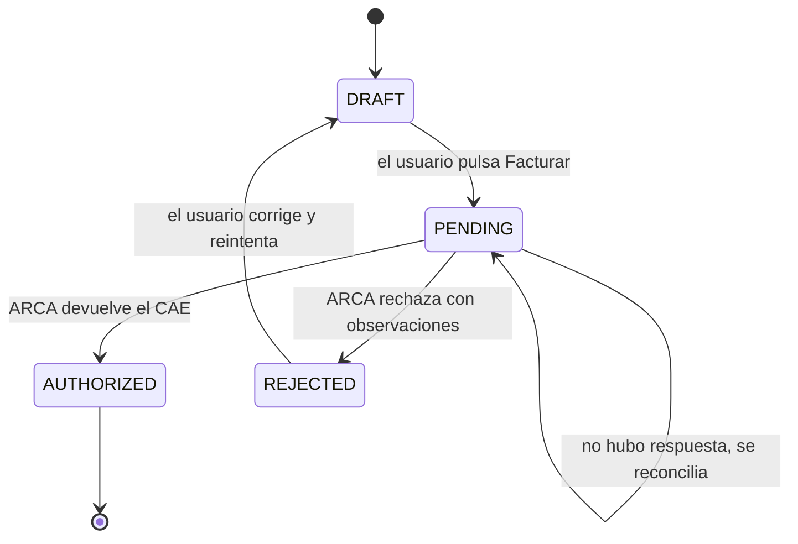

# Atomicidad y concurrencia

En este documento dejamos cómo vamos a manejar las operaciones que tocan plata para que se hagan completas o no se hagan (atomicidad), y para que dos pedidos que llegan al mismo tiempo no rompan las reglas de negocio (concurrencia). Todavía no hay código, así que esto es el diseño que vamos a seguir al programar el backend con Express y Prisma sobre PostgreSQL.

Relacionado: [Propuesta](./01-propuesta.md) (RN-01 a RN-14, RNF-04, RNF-07, RNF-08) y [Modelo de datos](./03-modelo-de-datos.md).

## Índice

1. [Por qué importa en este sistema](#1-por-qué-importa-en-este-sistema)
2. [Criterios generales](#2-criterios-generales)
3. [Operación por operación](#3-operación-por-operación)
4. [Emisión con ARCA: el caso crítico](#4-emisión-con-arca-el-caso-crítico)
5. [Ticket de acceso de WSAA](#5-ticket-de-acceso-de-wsaa)
6. [Cotizaciones del BCRA](#6-cotizaciones-del-bcra)
7. [Restricciones en la base de datos](#7-restricciones-en-la-base-de-datos)
8. [Impacto en el modelo de datos](#8-impacto-en-el-modelo-de-datos)
9. [Pruebas que lo verifican](#9-pruebas-que-lo-verifican)

---

## 1. Por qué importa en este sistema

Hay tres lugares donde un error de atomicidad o de concurrencia genera datos incorrectos que el usuario no puede detectar a simple vista:

| Riesgo | Qué pasaría | Regla afectada |
| --- | --- | --- |
| Dos pagos parciales registrados a la vez sobre la misma factura | La suma cobrada supera el total facturado | RN-10, RNF-07 |
| Un pago se guarda pero su movimiento (`Transaction`) no, o al revés | El dashboard muestra un cobrado que no coincide con la caja | RN-10, "un pago genera como máximo un movimiento" |
| Doble clic en "Facturar", o dos facturas del mismo punto de venta al mismo tiempo | ARCA rechaza por número duplicado, o se emiten dos comprobantes reales por la misma venta | RN-08, RN-09 |
| ARCA autoriza pero la respuesta se pierde (timeout) | La factura queda como no autorizada aunque ARCA ya le asignó CAE | RN-09, RN-11 |

Un monotributista trabaja solo o con muy poca gente, así que no esperamos mucha concurrencia real. Pero el doble clic, los reintentos del navegador, tener dos pestañas abiertas o que se corte la conexión pasan todo el tiempo. Y una factura emitida por error no se puede borrar (RN-11), así que preferimos prevenirlo desde el diseño.

## 2. Criterios generales

1. **Una operación de negocio es una transacción de base de datos.** Todo lo que cambia junto se escribe dentro de un mismo `prisma.$transaction(async (tx) => { ... })`. Si algo falla, no queda nada a medias.
2. **Nada de llamadas externas dentro de una transacción que tenga filas bloqueadas.** Una llamada a ARCA puede tardar segundos o colgarse, y además no se puede deshacer con un `ROLLBACK`. Por eso la separamos en pasos con estados intermedios (ver [sección 4](#4-emisión-con-arca-el-caso-crítico)).
3. **Las reglas que dependen de sumar se protegen bloqueando la fila dueña.** Para validar que los pagos no superen el total, bloqueamos la factura con `SELECT ... FOR UPDATE` antes de sumar. PostgreSQL trabaja por defecto en `READ COMMITTED`, que no alcanza para esto por sí solo.
4. **Las ediciones desde formularios usan control optimista.** El frontend manda el `updated_at` que leyó, y el backend actualiza con `WHERE id = ? AND updated_at = ?`. Si no se actualizó ninguna fila, alguien guardó antes y se responde 409. Así un cambio no pisa a otro sin que nadie se entere, y no hace falta una columna extra.
5. **La base de datos es la última defensa.** Además de validar en el servicio, hay índices únicos y restricciones `CHECK` (ver [sección 7](#7-restricciones-en-la-base-de-datos)). Si el código tiene un bug, la base rechaza el dato inválido.
6. **Los botones que escriben se deshabilitan mientras la request está en curso.** Para "Facturar" alcanza con eso y con el control de estado (un segundo pedido recibe 409). Para "Registrar pago" más adelante podemos sumar un encabezado `Idempotency-Key`, porque dos pagos iguales dentro del saldo serían válidos para la base.
7. **La auditoría se escribe en la misma transacción.** El `AuditLog` de una operación se inserta junto con ella, así no queda auditado algo que no pasó ni pasa algo sin auditar (RNF-08).
8. **Plata en `Decimal`, nunca en `float`.** Importes en `decimal(18,2)` y tipos de cambio en `decimal(18,6)`.
9. **Cada consulta filtra por organización, también dentro de una transacción** (RNF-04). No tiene que ser posible bloquear ni leer una fila de otra organización.

## 3. Operación por operación

| Operación | Qué se escribe en una sola transacción | Cómo se protege |
| --- | --- | --- |
| Crear factura (borrador) | `Invoice` con todos sus `InvoiceItem`, el total calculado en el backend, la copia de los datos del receptor y el `AuditLog` | El create anidado de Prisma ya es atómico. No hace falta bloqueo porque todavía no tiene número fiscal |
| Editar factura (borrador) | Reemplazo de ítems y recálculo del total | Control optimista, y solo si `status = DRAFT` |
| Registrar pago | `Payment`, su `Transaction` de ingreso y el `AuditLog` | `SELECT ... FOR UPDATE` sobre la factura y después validar que lo cobrado más el pago nuevo no supere el total. Ver el ejemplo |
| Anular pago | `voided_at` en el `Payment` y en su `Transaction`, más el `AuditLog` | El mismo bloqueo sobre la factura |
| Movimiento manual | `Transaction` y `AuditLog` | El alta no necesita bloqueo. La edición usa control optimista. Un movimiento que viene de un pago no se edita solo, se anula el pago |
| Baja lógica de cliente | `is_active = false` y `AuditLog` | Control optimista. Las facturas ya tienen su copia de los datos del receptor, así que no cambian |
| Autorizar en ARCA | Varias transacciones cortas con estados intermedios | Bloqueo por punto de venta y máquina de estados (sección 4) |

El estado comercial de la factura (pendiente, cobrada en parte, cobrada) no se guarda: se calcula sumando los pagos no anulados. Así no hay un campo más que mantener sincronizado.

### Ejemplo: registrar un pago sin superar el total

```ts
await prisma.$transaction(async (tx) => {
  // 1. Bloqueamos la factura. Otro pago sobre la misma factura espera acá hasta el commit.
  const [invoice] = await tx.$queryRaw<{ id: number; total_amount: Prisma.Decimal; status: string }[]>`
    SELECT id, total_amount, status
    FROM invoices
    WHERE id = ${invoiceId} AND organization_id = ${orgId}
    FOR UPDATE`;
  if (!invoice) throw new AppError(404, 'Factura no encontrada');
  if (invoice.status !== 'AUTHORIZED') throw new AppError(422, 'Solo se cobran facturas autorizadas');

  // 2. Sumamos lo ya cobrado. Con el bloqueo tomado, este valor no cambia hasta el commit.
  const { _sum } = await tx.payment.aggregate({
    where: { invoiceId, voidedAt: null },
    _sum: { amount: true },
  });
  const paid = _sum.amount ?? new Prisma.Decimal(0);
  if (paid.plus(amount).gt(invoice.total_amount)) throw new AppError(422, 'El pago supera el saldo pendiente');

  // 3. Pago, movimiento y auditoría: se guardan los tres o ninguno.
  const payment = await tx.payment.create({ data: { invoiceId, amount, currency, exchangeRate, paymentDate } });
  await tx.transaction.create({
    data: { organizationId: orgId, paymentId: payment.id, type: 'INCOME', amount, currency, exchangeRate,
            categoryId: cobroDeFacturasId, clientId, transactionDate: paymentDate },
  });
  await tx.auditLog.create({ data: { organizationId: orgId, userId, action: 'payment.created', entity: 'Payment', entityId: payment.id } });
});
```

El `FOR UPDATE` solo bloquea esa factura. Los pagos sobre facturas distintas siguen en paralelo.

## 4. Emisión con ARCA: el caso crítico

WSFEv1 impone dos condiciones que definen el diseño:

- **La numeración es correlativa por punto de venta y tipo de comprobante.** El número a enviar es el último autorizado más uno (`FECompUltimoAutorizado`). Si dos pedidos del mismo punto de venta consultan el último número al mismo tiempo, los dos mandan el mismo y uno es rechazado.
- **La autorización no se puede deshacer.** Si ARCA otorgó el CAE, el comprobante existe aunque nuestra base falle después.

### Estados fiscales



`AUTHORIZED` es final: la factura no se edita ni se borra (RN-11).

### Flujo en tres pasos

**Paso 1: reservar.** En una transacción corta bloqueamos la factura (`FOR UPDATE`), verificamos que esté en `DRAFT` y la pasamos a `PENDING`. Si ya no estaba en `DRAFT` (doble clic, otra pestaña), respondemos 409 sin llamar a ARCA.

**Paso 2: numerar y autorizar, de a una por punto de venta.** Dentro de una transacción con más tiempo de espera (por ejemplo 30 segundos):

1. `SELECT pg_advisory_xact_lock(<organización, punto de venta y tipo>)`. Esto hace que las emisiones del mismo punto de venta y tipo pasen de a una. El bloqueo se libera solo al terminar la transacción, aunque el proceso se caiga.
2. Pedimos `FECompUltimoAutorizado` y calculamos el número siguiente.
3. Mandamos `FECAESolicitar` con ese número.
4. Si ARCA aprueba, en la misma transacción guardamos `status = AUTHORIZED`, `voucher_number`, `cae`, `cae_expiration`, `authorized_at` y el `AuditLog`. Si rechaza, `status = REJECTED` y la respuesta en `arca_response`.

Esta transacción no bloquea filas de negocio, solo el bloqueo consultivo, así que no traba el resto del sistema mientras espera a ARCA.

**Paso 3: reconciliar cuando no sabemos qué pasó.** Si `FECAESolicitar` no responde, o la transacción del paso 2 falla después de que ARCA contestó, la factura queda en `PENDING`. No reintentamos a ciegas, porque podríamos emitir dos veces. En cambio:

- Pedimos `FECompUltimoAutorizado`. Si ARCA tiene un número más que el último que nosotros tenemos autorizado para ese punto de venta y tipo, consultamos ese comprobante con `FECompConsultar`.
- Si el comprobante existe en ARCA y coincide (importe, documento del receptor y fecha), la marcamos `AUTHORIZED` con ese CAE.
- Si no existe, vuelve a `DRAFT` para que el usuario reintente.
- Las facturas que quedaron más de 5 minutos en `PENDING` (según su `updated_at`) se reconcilian solas. En el MVP puede ser un botón en la pantalla de la factura o una tarea que corre cada tanto en el backend.

Todo esto supone que el punto de venta que usamos está dado de alta en ARCA solo para web service y que nadie emite comprobantes con él desde otro lado (por ejemplo, desde la web de ARCA). Si no, la numeración y la reconciliación no cierran.

### Ojo con el pooler de conexiones

Si la base se usa a través de un pooler en modo transacción (por ejemplo, el de Supabase o PgBouncer), los bloqueos consultivos de sesión (`pg_advisory_lock`) no funcionan bien. Por eso usamos la variante de transacción, `pg_advisory_xact_lock`, que sí funciona. Las migraciones de Prisma tienen que correr contra la conexión directa, que se configura en `backend/prisma.config.ts`.

## 5. Ticket de acceso de WSAA

- El ticket de acceso dura unas 12 horas. Mientras haya uno vigente, WSAA rechaza pedir otro para el mismo servicio, así que si dos pedidos intentan renovarlo a la vez, uno falla.
- Lo guardamos en la base, en `ArcaCredential` (`token`, `sign` y `token_expires_at`, por organización, ambiente y servicio), y no en memoria. Así sobrevive a un reinicio del backend.
- Para renovarlo:
  1. Leemos el ticket. Si vence en más de 10 minutos, lo usamos.
  2. Si no, abrimos una transacción con `pg_advisory_xact_lock(<organización y servicio>)` y lo volvemos a leer, porque otro pedido pudo haberlo renovado mientras esperábamos. Solo si sigue vencido llamamos a `LoginCms` y guardamos el nuevo.
- `token`, `sign` y la clave privada son credenciales: nunca se loguean ni se devuelven al frontend (RN-14).

## 6. Cotizaciones del BCRA

- El movimiento guarda una copia del tipo de cambio usado (`transactions.exchange_rate`), no una referencia a `exchange_rates`. Si después cambia la cotización, los movimientos viejos no se tocan (RN-06).
- `exchange_rates` es global y tiene un índice único por fuente, serie, monedas y fecha. Si dos pedidos traen la misma cotización a la vez, usamos `createMany({ skipDuplicates: true })` (que es `INSERT ... ON CONFLICT DO NOTHING`) y no se duplica nada.
- Si el BCRA no responde, usamos la última cotización guardada y mostramos de qué fecha es. Nunca bloqueamos el registro de un movimiento por una API caída: el usuario puede escribir el tipo de cambio a mano.

## 7. Restricciones en la base de datos

Las que Prisma no soporta van en una migración SQL escrita a mano.

| Restricción | Qué protege |
| --- | --- |
| Único `(point_of_sale_id, voucher_type, voucher_number)` en `invoices` | Que no haya dos comprobantes con el mismo número fiscal. Los borradores tienen número nulo y no chocan entre sí |
| Único `payment_id` en `transactions` | Que un pago genere como máximo un movimiento |
| `CHECK (amount > 0)` en `payments` y `transactions` | RN-03 |
| `CHECK ((status = 'AUTHORIZED') = (cae IS NOT NULL))` en `invoices` | RN-08 y RN-09 |
| `CHECK (currency = 'ARS' OR exchange_rate IS NOT NULL)` en `transactions` y `payments` | RN-05 |
| `ON DELETE RESTRICT` en `transactions.payment_id`, `transactions.category_id` y `payments.invoice_id` | Que no queden ingresos sueltos ni movimientos sin categoría |

## 8. Impacto en el modelo de datos

Todo lo que surge de este análisis ya está en el [modelo de datos](./03-modelo-de-datos.md): la relación de uno a cero o uno entre pago y movimiento, `voided_at` en pagos y movimientos, la copia de los datos del receptor en la factura, las credenciales de ARCA con el ticket de WSAA y las restricciones de la sección anterior.

## 9. Pruebas que lo verifican

Van en la suite de integración (Vitest y Supertest contra un PostgreSQL real, no contra mocks). Los problemas de concurrencia no aparecen con mocks.

| Prueba | Cómo | Resultado esperado |
| --- | --- | --- |
| Pagos simultáneos que superan el total | Factura de $1000 y dos pagos de $600 con `Promise.all` | Uno se guarda y el otro devuelve 422. Cobrado: $600 |
| Pago sin movimiento | Forzar un error después de crear el `Payment` | No queda ni el pago ni el movimiento |
| Doble "Facturar" | Dos POST a `/invoices/:id/authorize` con `Promise.all` | Uno llama a ARCA, el otro devuelve 409 |
| Dos facturas del mismo punto de venta a la vez | `ArcaClient` simulado que valida la correlatividad | Números consecutivos, sin rechazos |
| ARCA no responde | `ArcaClient` simulado que autoriza y corta la conexión | Queda en `PENDING` y la reconciliación la pasa a `AUTHORIZED` con el CAE correcto |
| Renovación simultánea del ticket | Dos llamadas con el ticket vencido | Una sola llamada a `LoginCms` |
| Edición simultánea | Dos `PATCH` con el mismo `updated_at` | El segundo devuelve 409 |
| La cotización cambia después de registrar | Movimiento en USD y después una cotización nueva | El movimiento conserva su tipo de cambio original |
