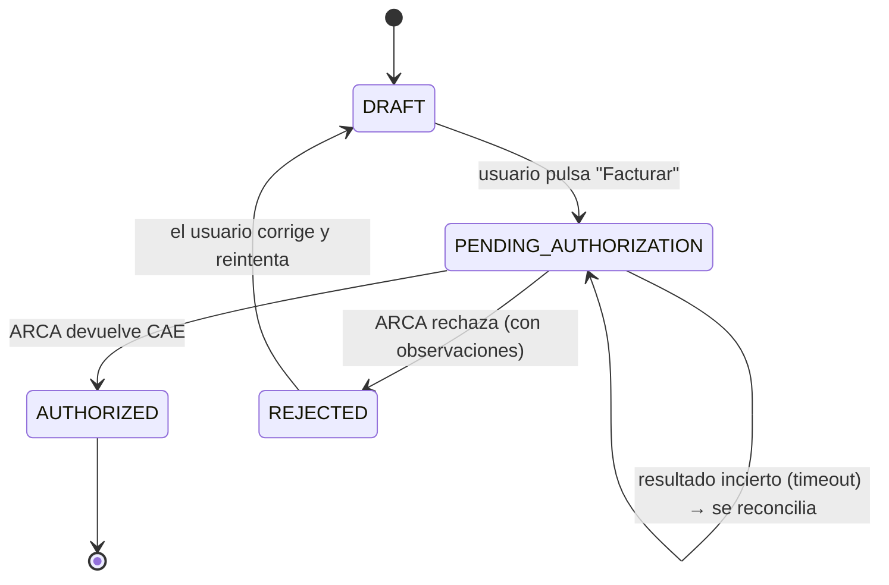

# Atomicidad y concurrencia

> Decisiones de diseño para que las operaciones financieras sean **atómicas** (se hacen completas o no se hacen) y **seguras ante concurrencia** (dos pedidos simultáneos no rompen las reglas de negocio). Aplica al backend (Express + Prisma) sobre PostgreSQL.
>
> Relacionado: [Propuesta](./01-propuesta.md) (RN-01..14, RNF-04, RNF-07, RNF-08) · [DER inicial](./img/der-inicial.png)

## Índice

1. [Por qué importa en este sistema](#1-por-qué-importa-en-este-sistema)
2. [Criterios generales](#2-criterios-generales)
3. [Operación por operación](#3-operación-por-operación)
4. [Emisión con ARCA: el caso crítico](#4-emisión-con-arca-el-caso-crítico)
5. [Ticket de acceso WSAA](#5-ticket-de-acceso-wsaa)
6. [Cotizaciones BCRA](#6-cotizaciones-bcra)
7. [Restricciones en la base de datos](#7-restricciones-en-la-base-de-datos)
8. [Impacto en el DER](#8-impacto-en-el-der)
9. [Pruebas que lo verifican](#9-pruebas-que-lo-verifican)

---

## 1. Por qué importa en este sistema

Hay tres lugares donde un error de atomicidad o de concurrencia genera datos incorrectos que el usuario no puede detectar a simple vista:

| Riesgo | Qué pasaría | Regla afectada |
| --- | --- | --- |
| Dos pagos parciales registrados a la vez sobre la misma factura | La suma cobrada supera el total facturado | RN-10, RNF-07 |
| Un pago se guarda pero su movimiento (`Transaction`) no, o al revés | El dashboard muestra cobrado ≠ caja | RN-10, "un pago genera como máximo un movimiento" |
| Doble clic en "Facturar", o dos facturas del mismo punto de venta al mismo tiempo | ARCA rechaza por número duplicado, o se emiten dos comprobantes reales por la misma venta | RN-08, RN-09 |
| ARCA autoriza pero la respuesta se pierde (timeout) | La factura queda como no autorizada aunque ARCA ya le asignó CAE | RN-09, RN-11 |

Un monotributista trabaja solo o con muy poca gente, así que la concurrencia real es baja. Aun así, doble clic, reintentos del navegador, dos pestañas abiertas y timeouts de red pasan todos los días. Y un comprobante fiscal emitido por error no se puede borrar (RN-11).

## 2. Criterios generales

1. **Una operación de negocio = una transacción de base de datos.** Todo lo que cambia junto se escribe dentro de un mismo `prisma.$transaction(async (tx) => { ... })`. Si algo falla, no queda nada a medias.
2. **Nada de llamadas externas dentro de una transacción que tenga filas bloqueadas.** Una llamada a ARCA puede tardar segundos o colgarse, y además no se puede deshacer con un `ROLLBACK`. Se separa en pasos con estados intermedios (ver [sección 4](#4-emisión-con-arca-el-caso-crítico)).
3. **Las invariantes se protegen con bloqueo pesimista sobre la fila "dueña".** Por ejemplo, para validar "suma de pagos ≤ total" se bloquea la factura con `SELECT … FOR UPDATE` antes de sumar. PostgreSQL trabaja por defecto en `READ COMMITTED`, que no alcanza para esto por sí solo.
4. **Ediciones de usuario con control optimista.** Las entidades editables desde formularios (cliente, movimiento manual, factura en borrador) tienen una columna `version`. El `UPDATE … WHERE id = ? AND version = ?` falla si otra pestaña guardó antes. Así se evita que un cambio pise a otro sin que nadie se entere.
5. **La base de datos es la última defensa.** Además de validar en el servicio, se agregan índices únicos y `CHECK` (ver [sección 7](#7-restricciones-en-la-base-de-datos)). Si el código tiene un bug, la BD rechaza el dato inválido.
6. **Idempotencia en las operaciones sensibles.** "Facturar" y "Registrar pago" aceptan un encabezado `Idempotency-Key` generado por el frontend. Además, el botón se deshabilita mientras la request está en curso.
7. **La auditoría se escribe en la misma transacción.** El `AuditLog` de una operación se inserta dentro de la misma transacción, así no queda auditado algo que no pasó ni pasa algo sin auditar (RNF-08).
8. **Dinero en `Decimal`, nunca en `float`.** Se usa `Decimal(14,2)` en Prisma (`numeric` en PostgreSQL) para importes, y `Decimal(18,6)` para tipos de cambio.
9. **Aislamiento entre organizaciones dentro de la transacción.** Todas las consultas, incluidas las de dentro de una transacción, filtran por `organization_id` (RNF-04). Bloquear una fila de otra organización tiene que ser imposible.

## 3. Operación por operación

| Operación | Qué se escribe en una sola transacción | Protección de concurrencia |
| --- | --- | --- |
| **Crear factura (borrador)** | `Invoice` + todos sus `InvoiceItem` + totales calculados en el servidor + snapshot del receptor (nombre, documento, condición fiscal) + `AuditLog` | Create anidado de Prisma: es atómico por sí solo. No hace falta bloqueo porque todavía no tiene número fiscal |
| **Editar factura (borrador)** | Reemplazo de ítems + recálculo de totales | Optimista (`version`), y solo se permite si `fiscal_status = DRAFT` |
| **Registrar pago** | `Payment` + su `Transaction` (INCOME) + actualización del estado comercial + `AuditLog` | `SELECT … FOR UPDATE` sobre la factura, luego validar `pagado + nuevo ≤ total`. Ver el ejemplo más abajo |
| **Anular pago** | Marcar el `Payment` como anulado + anular su `Transaction` + recalcular el estado comercial + `AuditLog` | Mismo bloqueo sobre la factura |
| **Movimiento manual (ingreso/egreso)** | `Transaction` + `AuditLog` | Alta: sin bloqueo. Edición: optimista (`version`). Un movimiento generado por un pago no se edita directamente, sino a través del pago |
| **Baja lógica de cliente** | `Client.is_active = false` + `AuditLog` | Optimista. Las facturas ya guardaron su snapshot del receptor, así que editar o dar de baja al cliente no altera comprobantes existentes |
| **Autorizar en ARCA** | Varias transacciones cortas con estados intermedios | Bloqueo por punto de venta + máquina de estados (sección 4) |

### Ejemplo: registrar un pago sin superar el total

```ts
await prisma.$transaction(async (tx) => {
  // 1. Bloquea la factura: otro pago concurrente sobre la MISMA factura espera acá.
  const [invoice] = await tx.$queryRaw<{ id: string; total_amount: Prisma.Decimal; fiscal_status: string }[]>`
    SELECT id, total_amount, fiscal_status
    FROM "Invoice"
    WHERE id = ${invoiceId} AND organization_id = ${orgId}
    FOR UPDATE`;
  if (!invoice) throw new NotFoundError();
  if (invoice.fiscal_status !== 'AUTHORIZED') throw new BusinessError('Solo se cobran facturas autorizadas');

  // 2. Suma lo ya cobrado (con el lock tomado, el valor no cambia hasta el commit).
  const { _sum } = await tx.payment.aggregate({
    where: { invoiceId, voidedAt: null },
    _sum: { amount: true },
  });
  const paid = _sum.amount ?? new Prisma.Decimal(0);
  if (paid.plus(amount).gt(invoice.total_amount)) throw new BusinessError('El pago supera el saldo pendiente');

  // 3. Pago + movimiento + estado comercial + auditoría: todo o nada.
  const payment = await tx.payment.create({ data: { invoiceId, amount, currency, exchangeRate, paymentDate } });
  await tx.transaction.create({ data: { organizationId: orgId, paymentId: payment.id, type: 'INCOME', amount, currency, exchangeRate, categoryId, clientId, transactionDate: paymentDate } });
  const newPaid = paid.plus(amount);
  await tx.invoice.update({
    where: { id: invoiceId },
    data: { commercialStatus: newPaid.eq(invoice.total_amount) ? 'PAID' : 'PARTIALLY_PAID' },
  });
  await tx.auditLog.create({ data: { organizationId: orgId, action: 'PAYMENT_CREATED', entityId: payment.id } });
});
```

> El `FOR UPDATE` solo bloquea **esa** factura. Pagos sobre facturas distintas siguen en paralelo.

## 4. Emisión con ARCA: el caso crítico

WSFEv1 impone dos condiciones que definen el diseño:

- **Numeración correlativa por punto de venta y tipo de comprobante.** El número a enviar tiene que ser el último autorizado + 1 (`FECompUltimoAutorizado` + 1). Si dos pedidos del mismo punto de venta consultan el último número al mismo tiempo, los dos mandan el mismo número y uno es rechazado.
- **La llamada no es reversible.** Si ARCA otorgó el CAE, el comprobante existe aunque nuestra BD falle después. No se puede "deshacer" con un rollback.

### Máquina de estados fiscal



`AUTHORIZED` es terminal: no se edita ni se borra (RN-11). El estado comercial (`PENDING`, `PARTIALLY_PAID`, `PAID`) es un campo aparte y solo existe para facturas autorizadas (RN-10).

### Flujo en tres pasos

**Paso 1: reservar (transacción corta).**
Se bloquea la factura (`FOR UPDATE`) y se verifica `fiscal_status = DRAFT`. Luego se pasa a `PENDING_AUTHORIZATION` y se guarda `authorization_requested_at`. Si el estado ya no era `DRAFT` (doble clic, otra pestaña), se responde **409 Conflict** sin llamar a ARCA. Esta es la idempotencia a nivel de negocio.

**Paso 2: numerar y autorizar (serializado por punto de venta).**
Dentro de una transacción con timeout ampliado (por ejemplo 30 s):

1. `SELECT pg_advisory_xact_lock(<clave de org + punto de venta + tipo>)`. Serializa solo las emisiones del mismo punto de venta y tipo. El lock se libera solo al terminar la transacción, aunque el proceso se caiga.
2. `FECompUltimoAutorizado` → número = último + 1.
3. `FECAESolicitar` con ese número. Antes de enviarlo, se guarda en la factura (`voucher_number`, `arca_request_payload`).
4. Si aprueba, en la misma transacción: `fiscal_status = AUTHORIZED`, `cae`, `cae_expiration`, `voucher_number` y `AuditLog`. Si rechaza: `fiscal_status = REJECTED` + observaciones de ARCA.

Esta transacción no bloquea filas de negocio (solo el advisory lock), así que no traba el resto de la app mientras espera a ARCA.

**Paso 3: reconciliar resultados inciertos.**
Si la llamada a `FECAESolicitar` da timeout, o si la transacción del paso 2 falla después de que ARCA respondió, la factura queda en `PENDING_AUTHORIZATION`. **No se reintenta a ciegas**, porque podría emitirse dos veces. En cambio:

- Se consulta `FECompConsultar` con el punto de venta, tipo y número que se había enviado.
- Si el comprobante existe en ARCA y coincide (importe, documento del receptor, fecha), se marca `AUTHORIZED` con ese CAE.
- Si no existe, vuelve a `DRAFT` para que el usuario reintente.
- Un proceso periódico revisa las facturas que quedaron más de 5 minutos en `PENDING_AUTHORIZATION` y ejecuta esta reconciliación. En el MVP puede ser un endpoint o un `setInterval` en el backend.

### Advertencia sobre el pooler de conexiones

Si la base se sirve a través de un pooler en *transaction mode* (por ejemplo, el pooler de Supabase o PgBouncer), los **advisory locks de sesión** (`pg_advisory_lock`) no funcionan de forma confiable. Por eso se usa la variante de transacción (`pg_advisory_xact_lock`), que sí funciona detrás de un pooler en ese modo. Para las migraciones de Prisma hay que usar la conexión directa (`directUrl`).

## 5. Ticket de acceso WSAA

- El ticket de acceso (TA) dura unas 12 horas. Mientras exista uno vigente, WSAA rechaza pedir otro para el mismo servicio. Si dos pedidos intentan renovarlo a la vez, uno falla.
- Se guarda en la BD (tabla `ArcaAccessTicket`: `organization_id`, `service`, `token`, `sign`, `expires_at`), no en memoria. Así sobrevive a reinicios y se comparte entre instancias.
- La renovación se hace con *double-checked locking*:
  1. Se lee el TA. Si vence en más de 10 minutos, se usa.
  2. Si no, se abre una transacción con `pg_advisory_xact_lock(<clave de org + servicio>)`, se **vuelve a leer** (otro pedido pudo haberlo renovado mientras se esperaba el lock) y solo si sigue vencido se llama a `LoginCms` y se guarda el nuevo.
- `token` y `sign` son credenciales: nunca se loguean ni se devuelven al frontend (RN-14).

## 6. Cotizaciones BCRA

- **RN-06:** el movimiento guarda una **copia** del tipo de cambio usado (`Transaction.exchange_rate`), no solo una referencia a `ExchangeRate`. Actualizar la cotización no toca movimientos viejos.
- La cotización es la misma para todas las organizaciones. `ExchangeRate` es global, con un índice único `(currency, rate_date, source)`.
- Si dos pedidos refrescan la cotización a la vez, se usa `INSERT … ON CONFLICT DO NOTHING` (`createMany({ skipDuplicates: true })` en Prisma). No se generan duplicados ni errores.
- Si el BCRA no responde, se usa la última cotización guardada y se muestra su fecha (degradación controlada). Nunca se bloquea el registro de un movimiento por una API externa caída: el usuario puede cargar el tipo de cambio a mano.

## 7. Restricciones en la base de datos

Se definen en `schema.prisma`. Las que Prisma no soporta nativamente van en una migración SQL manual.

| Restricción | Protege |
| --- | --- |
| `UNIQUE (organization_id, point_of_sale_id, voucher_type, voucher_number)` en `Invoice` (con número no nulo) | Nunca dos facturas con el mismo número fiscal |
| `UNIQUE (payment_id)` en `Transaction` (nullable) | Un pago genera como máximo un movimiento |
| `CHECK (amount > 0)` en `Payment`, `Transaction` e `InvoiceItem.unit_price >= 0` | RN-03 |
| `CHECK (fiscal_status <> 'AUTHORIZED' OR cae IS NOT NULL)` y `CHECK (cae IS NULL OR fiscal_status = 'AUTHORIZED')` | RN-08, RN-09 |
| `CHECK (currency = base_currency OR exchange_rate IS NOT NULL)` (vía trigger o validación, porque cruza tablas) | RN-05 |
| `UNIQUE (currency, rate_date, source)` en `ExchangeRate` | Sin cotizaciones duplicadas |
| `UNIQUE (idempotency_key, organization_id)` en una tabla `IdempotencyKey` | Reintentos del frontend no duplican pagos o emisiones |
| `onDelete: Restrict` en relaciones de `Invoice` (con `Payment`, `InvoiceItem`, `Client`) | RN-11, RN-12: no se borra en cascada historia fiscal |

## 8. Impacto en el DER

Cambios que surgen de este análisis sobre el [DER inicial](./img/der-inicial.png):

- **Invoice:** separar `status` en `fiscal_status` (`DRAFT`, `PENDING_AUTHORIZATION`, `AUTHORIZED`, `REJECTED`) y `commercial_status` (`PENDING`, `PARTIALLY_PAID`, `PAID`). Sumar `version`, `authorization_requested_at`, `arca_observations` y el snapshot del receptor (tipo y número de documento, condición frente al IVA).
- **Payment:** sumar `currency`, `exchange_rate`, `payment_method` y `voided_at` (anulación lógica).
- **Transaction:** sumar `exchange_rate`, `client_id` (opcional), `description` y `version`. La relación con `Payment` pasa a ser **0..1 : 1** (`payment_id` único y opcional).
- **ExchangeRate:** sin `organization_id` (es global), con `rate_date` y `source`.
- **Nuevas tablas:** `ArcaAccessTicket` (ticket WSAA) e `IdempotencyKey`. Para `AuditLog`, confirmar que ya está prevista en el modelo conceptual.

## 9. Pruebas que lo verifican

Estas pruebas van en la suite de integración (Vitest/Jest + Supertest contra una base PostgreSQL real, no mocks). Los problemas de concurrencia no aparecen con mocks.

| Prueba | Cómo | Resultado esperado |
| --- | --- | --- |
| Pagos concurrentes que superan el total | Factura de $1000; `Promise.all` con dos pagos de $600 | Uno se guarda, el otro devuelve 422; cobrado = $600 |
| Pago sin movimiento | Forzar un error después de crear el `Payment` | No queda ni el pago ni el movimiento |
| Doble "Facturar" | `Promise.all` con dos POST a `/invoices/:id/authorize` | Uno llama a ARCA, el otro devuelve 409 |
| Dos facturas del mismo punto de venta a la vez | Mock de ARCA que valida correlatividad | Números consecutivos, sin rechazos |
| Timeout de ARCA | Mock que autoriza y luego corta la conexión | Queda en `PENDING_AUTHORIZATION`; la reconciliación la pasa a `AUTHORIZED` con el CAE correcto |
| Renovación concurrente del TA | Dos llamadas con el TA vencido | Una sola llamada a `LoginCms` |
| Edición concurrente | Dos `PATCH` con la misma `version` | El segundo devuelve 409 |
| Cotización cambia después de registrar | Registrar un movimiento en USD y luego actualizar la cotización | El movimiento conserva su `exchange_rate` original |
