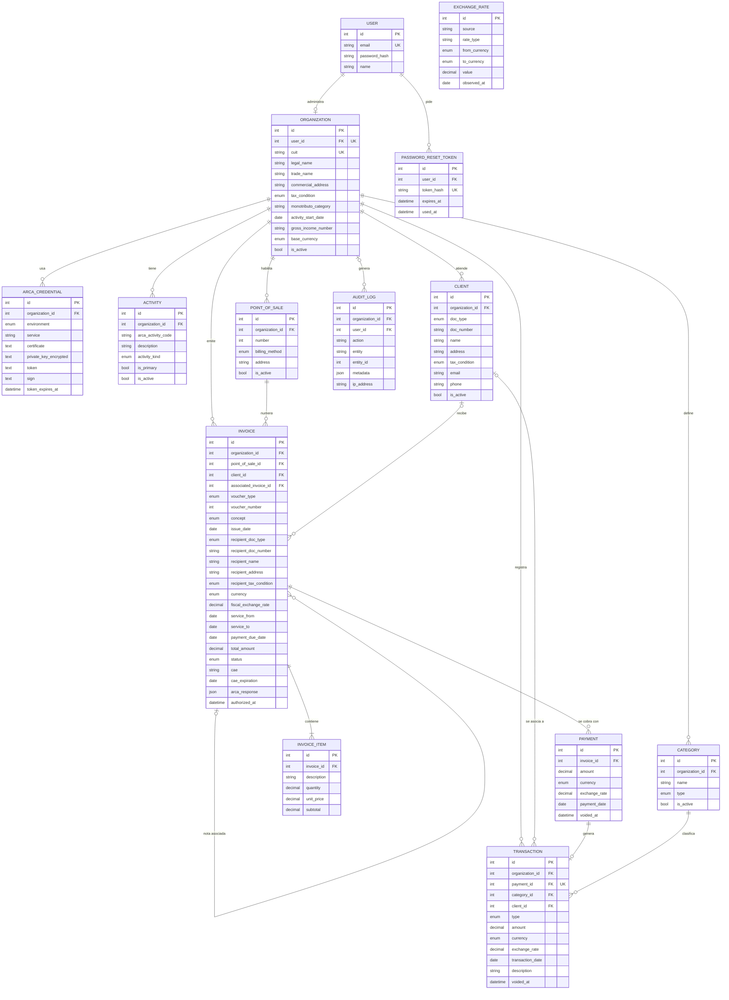

# Modelo de datos

Este documento describe el modelo de datos del sistema y reemplaza al [DER inicial](./img/der-inicial.png) de la primera entrega. El diagrama está en Mermaid, así que GitHub lo dibuja solo y lo vamos actualizando como texto.

El esquema real lo escribimos con Prisma en `backend/prisma/schema/`, repartido en varios archivos (`users`, `catalog`, `finance`, `invoice`, `audit` y `enums`). Este documento y ese esquema tienen que decir lo mismo. Si cambia uno, se actualiza el otro en el mismo PR.

Están todas las entidades que pidió la cátedra para esta instancia (Organization, Client, Transaction, Invoice, InvoiceItem y Payment), más las que hacen falta para autenticarse, facturar con ARCA y auditar.

## Qué cambió respecto del DER inicial

1. **Payment y Transaction.** En el primer diagrama un pago podía tener muchos movimientos. Ahora cada pago genera como máximo un movimiento de ingreso: `transactions.payment_id` es opcional (los movimientos cargados a mano no vienen de un pago) y único.
2. **Transaction** suma `client_id` para el historial por cliente y `description`. El tipo de cambio pasa a ser obligatorio cuando la moneda no es la base (RN-05).
3. **Invoice** guarda una copia de los datos del receptor (documento, nombre, domicilio y condición frente al IVA), las fechas de servicio que pide ARCA, la respuesta de ARCA y la fecha de autorización. También puede apuntar a otra factura (`associated_invoice_id`), para cuando agreguemos notas de crédito y débito.
4. **ExchangeRate** deja de depender de la organización, porque la cotización del BCRA es la misma para todos.
5. **Organization** suma los datos fiscales que van impresos en el comprobante: condición frente al IVA, categoría de monotributo, inicio de actividades, domicilio comercial e ingresos brutos.
6. **Tablas nuevas:**
   - `ArcaCredential`: certificado, clave privada cifrada y ticket de acceso de WSAA, por organización y ambiente.
   - `PasswordResetToken`: recuperación de contraseña, que está en el alcance del MVP.
   - `AuditLog`: ya estaba en el modelo conceptual, pero no en el diagrama.

`FinancialInquiry` (Central de Deudores) y `Notification` (WhatsApp) siguen en el modelo conceptual de la propuesta, pero no están acá porque son P1.

## Diagrama

## Criterios generales

- Los `id` son enteros autoincrementales. Como son predecibles, toda consulta filtra por `organization_id` del usuario logueado (RNF-04): nunca alcanza con el `id` solo.
- Todas las tablas de negocio tienen `created_at` y `updated_at`. `updated_at` también nos sirve como control de edición concurrente (ver [Atomicidad y concurrencia](./02-atomicidad-concurrencia.md#2-criterios-generales)).
- Los importes son `decimal(18,2)` y los tipos de cambio `decimal(18,6)`. Nunca usamos `float` para plata.
- Nada que tenga historia se borra: clientes, categorías, actividades y puntos de venta tienen `is_active` (baja lógica), y pagos y movimientos se anulan con `voided_at`.

## Diccionario de datos

### User

| Campo | Tipo | Nulo | Descripción |
| --- | --- | --- | --- |
| email | varchar(255) | no | Único. Es el usuario para iniciar sesión. Se guarda en minúsculas. |
| password_hash | varchar(255) | no | Hash Argon2id (RNF-02). Nunca guardamos la contraseña. |
| name | varchar(255) | sí | Nombre para mostrar. |

### PasswordResetToken

| Campo | Tipo | Nulo | Descripción |
| --- | --- | --- | --- |
| user_id | int | no | Usuario que pidió recuperar la contraseña. |
| token_hash | varchar(64) | no | Hash del token que se manda por mail. El token en sí nunca se guarda. |
| expires_at | timestamp | no | Vencimiento del token. |
| used_at | timestamp | sí | Se completa al usarlo. Un token usado no sirve de nuevo. |

### Organization

Por ahora cada usuario tiene una sola organización (su actividad como monotributista), por eso `user_id` es único.

| Campo | Tipo | Nulo | Descripción |
| --- | --- | --- | --- |
| user_id | int | no | Dueño. Único. |
| cuit | char(11) | no | CUIT sin guiones. Único. Se valida el dígito verificador. |
| legal_name | varchar(255) | no | Razón social o nombre y apellido, como figura en ARCA. |
| trade_name | varchar(255) | sí | Nombre de fantasía. |
| commercial_address | varchar(255) | sí | Domicilio comercial. Va impreso en la factura, así que es obligatorio antes de facturar. |
| tax_condition | enum | no | Para el P0, `MONOTRIBUTO`. |
| monotributo_category | varchar(10) | sí | Categoría de monotributo. Informativo. |
| activity_start_date | date | sí | Inicio de actividades. Va impreso en la factura, obligatorio antes de facturar. |
| gross_income_number | varchar(50) | sí | Número de ingresos brutos. |
| base_currency | enum | no | Moneda en la que se muestran los totales. Por defecto `ARS` (RF-06). |
| is_active | boolean | no | Baja lógica. |

### ArcaCredential

| Campo | Tipo | Nulo | Descripción |
| --- | --- | --- | --- |
| organization_id | int | no | Organización dueña del certificado. |
| environment | enum | no | `HOMOLOGACION` o `PRODUCCION`. En el TFI usamos solo homologación. |
| service | varchar(50) | no | Servicio de ARCA, por ahora `wsfe`. Único junto con la organización y el ambiente. |
| certificate | text | no | Certificado que emite ARCA. |
| private_key_encrypted | text | no | Clave privada cifrada con una clave que vive en una variable de entorno. Nunca en texto plano ni en el repo (RN-14). |
| token, sign | text | sí | Ticket de acceso de WSAA. No se loguean ni se mandan al frontend. |
| token_expires_at | timestamp | sí | Vencimiento del ticket (unas 12 horas). |

### Activity

| Campo | Tipo | Nulo | Descripción |
| --- | --- | --- | --- |
| organization_id | int | no | Organización dueña. |
| arca_activity_code | varchar(20) | sí | Código de actividad según el nomenclador de ARCA. |
| description | varchar(255) | no | Descripción de la actividad. |
| activity_kind | enum | no | `GOODS` o `SERVICES`. Sirve para sugerir el concepto de la factura. |
| is_primary | boolean | no | Actividad principal. |
| is_active | boolean | no | Baja lógica. |

### PointOfSale

| Campo | Tipo | Nulo | Descripción |
| --- | --- | --- | --- |
| organization_id | int | no | Organización dueña. |
| number | int | no | Número del punto de venta dado de alta en ARCA. Único por organización. |
| billing_method | enum | no | `CAE` (autorización comprobante por comprobante, lo que usamos) o `CAEA` (anticipado, no lo usamos en el MVP). |
| address | varchar(255) | sí | Domicilio del punto de venta. |
| is_active | boolean | no | Baja lógica. |

### Client

| Campo | Tipo | Nulo | Descripción |
| --- | --- | --- | --- |
| organization_id | int | no | Organización dueña (RNF-04). |
| doc_type | enum | sí | `CUIT` (80), `CUIL` (86), `DNI` (96), `PASAPORTE` (94) o `SIN_IDENTIFICAR` (99). Entre paréntesis, el código que usa ARCA. |
| doc_number | varchar(20) | sí | Único por organización y tipo de documento. |
| name | varchar(255) | no | Nombre o razón social. |
| address | varchar(255) | sí | Domicilio. |
| tax_condition | enum | sí | Condición frente al IVA. Obligatoria antes de facturarle. |
| email, phone | varchar | sí | Contacto. |
| is_active | boolean | no | Baja lógica (RN-12). |

### Category

| Campo | Tipo | Nulo | Descripción |
| --- | --- | --- | --- |
| organization_id | int | no | Organización dueña. |
| name | varchar(100) | no | Único por organización y tipo. |
| type | enum | no | `INCOME` o `EXPENSE`. Un movimiento solo puede usar una categoría de su mismo tipo. |
| is_active | boolean | no | Baja lógica. Las categorías no se borran, así los movimientos nunca quedan sin categoría. |

Al crear la organización se crean categorías por defecto, entre ellas "Cobro de facturas", que es la que usan los movimientos generados por pagos.

### ExchangeRate

| Campo | Tipo | Nulo | Descripción |
| --- | --- | --- | --- |
| source | varchar(50) | no | De dónde sale el valor: `BCRA` o `MANUAL`. |
| rate_type | varchar(50) | no | Serie usada. Para gestión, la definida en [Cotización](./05-cotizacion.md). |
| from_currency, to_currency | enum | no | Por ejemplo, de `USD` a `ARS`. |
| value | decimal(18,6) | no | Unidades de `to_currency` por cada unidad de `from_currency`. |
| observed_at | date | no | Día al que corresponde la cotización. |
| created_at | timestamp | no | Cuándo la consultamos (RN-13). |

Índice único en `(source, rate_type, from_currency, to_currency, observed_at)`.

### Invoice

| Campo | Tipo | Nulo | Descripción |
| --- | --- | --- | --- |
| organization_id | int | no | Emisor. |
| point_of_sale_id | int | no | Punto de venta con el que se numera. |
| client_id | int | sí | Cliente, si está cargado. Puede faltar en una venta a consumidor final. |
| associated_invoice_id | int | sí | Factura a la que corrige una nota de crédito o débito (P1). |
| voucher_type | enum | no | `FACTURA_C` (11), `NOTA_DEBITO_C` (12) o `NOTA_CREDITO_C` (13). En el P0 solo `FACTURA_C`. |
| voucher_number | int | sí | Se asigna al autorizar. Único por punto de venta y tipo de comprobante. |
| concept | enum | no | `PRODUCTOS` (1), `SERVICIOS` (2) o `PRODUCTOS_Y_SERVICIOS` (3). Cómo se elige está en [Factura, cobro y pagos parciales](./04-factura-cobro-y-pagos.md#concepto-de-la-factura). |
| issue_date | date | no | Fecha del comprobante. |
| recipient_doc_type, recipient_doc_number, recipient_name, recipient_address, recipient_tax_condition | varios | sí | Copia de los datos del receptor. Se completan al crear la factura y son obligatorios para pedir la autorización. Si después se edita el cliente, la factura no cambia. |
| currency | enum | no | En el P0 siempre `ARS`. |
| fiscal_exchange_rate | decimal(18,6) | no | `1` para pesos. Para moneda extranjera, la cotización que exige ARCA (ver [Cotización](./05-cotizacion.md)). |
| service_from, service_to, payment_due_date | date | sí | Obligatorios si el concepto incluye servicios. |
| total_amount | decimal(18,2) | no | Suma de los subtotales. Lo calcula el backend (RF-23). |
| status | enum | no | Estado fiscal: `DRAFT`, `PENDING`, `AUTHORIZED` o `REJECTED`. |
| cae, cae_expiration | varchar(14), date | sí | Solo si está autorizada (RN-09). |
| arca_response | jsonb | sí | Observaciones y errores que devolvió ARCA. |
| authorized_at | timestamp | sí | Cuándo se autorizó. |

El estado comercial (pendiente, cobrada en parte, cobrada) no se guarda: se calcula a partir de los pagos no anulados. Así nunca puede quedar desfasado.

### InvoiceItem

| Campo | Tipo | Nulo | Descripción |
| --- | --- | --- | --- |
| invoice_id | int | no | Factura a la que pertenece. Toda factura tiene al menos un ítem (RN-07). Si se borra un borrador, se borran sus ítems. |
| description | varchar(255) | no | Producto o servicio. |
| quantity | decimal(18,3) | no | Mayor a cero. |
| unit_price | decimal(18,2) | no | Mayor o igual a cero. |
| subtotal | decimal(18,2) | no | `quantity * unit_price`, redondeado a dos decimales. |

### Payment

| Campo | Tipo | Nulo | Descripción |
| --- | --- | --- | --- |
| invoice_id | int | no | Factura que se cobra. Tiene que estar autorizada. |
| amount | decimal(18,2) | no | Mayor a cero. La suma de pagos no anulados no puede superar el total. |
| currency, exchange_rate | enum, decimal | no, sí | En el P0 coinciden con los de la factura. |
| payment_date | date | no | Día en que se cobró. Es la fecha que cuenta para la caja. |
| voided_at | timestamp | sí | Si tiene fecha, el pago está anulado y no suma. |

### Transaction

| Campo | Tipo | Nulo | Descripción |
| --- | --- | --- | --- |
| organization_id | int | no | Organización (RN-01). |
| payment_id | int | sí | Si el movimiento viene de un cobro. Único. |
| category_id | int | no | Categoría del mismo tipo que el movimiento. |
| client_id | int | sí | Cliente asociado, si corresponde. |
| type | enum | no | `INCOME` o `EXPENSE` (RN-02). |
| amount | decimal(18,2) | no | Mayor a cero (RN-03). |
| currency | enum | no | Obligatoria (RN-04). |
| exchange_rate | decimal(18,6) | sí | Obligatorio si la moneda no es la base. Es una copia del valor usado, no una referencia (RN-05, RN-06). |
| transaction_date | date | no | Fecha del movimiento. |
| description | varchar(255) | sí | Detalle libre. |
| voided_at | timestamp | sí | Anulación. Un movimiento anulado no suma en el dashboard. |

### AuditLog

| Campo | Tipo | Nulo | Descripción |
| --- | --- | --- | --- |
| organization_id | int | sí | Organización. Puede faltar en eventos previos a tenerla, como el registro. |
| user_id | int | sí | Quién hizo la acción. Nulo si fue un proceso automático. |
| action | varchar(100) | no | Por ejemplo `auth.login`, `invoice.authorized`, `payment.created`. |
| entity, entity_id | varchar, int | sí | Qué registro se tocó. |
| metadata | jsonb | sí | Datos del evento, sin contraseñas, tokens ni claves. |
| ip_address | varchar(45) | sí | IP del pedido. |

## Restricciones en la base de datos

Además de las claves y los índices únicos, van estas restricciones. Las que Prisma no soporta se agregan a mano en una migración SQL.

| Restricción | Para qué |
| --- | --- |
| `amount > 0` en `payments` y `transactions`; `quantity > 0` y `unit_price >= 0` en `invoice_items`; `total_amount >= 0` en `invoices` | RN-03 |
| `status = 'AUTHORIZED'` si y solo si `cae` no es nulo | RN-08 y RN-09 |
| `currency = 'ARS' OR exchange_rate IS NOT NULL` en `transactions` y `payments` | RN-05 |
| `transactions.payment_id` y `transactions.category_id` con `ON DELETE RESTRICT` | Que no quede un ingreso suelto si alguien borra un pago, ni un movimiento sin categoría |
| `payments.invoice_id` e `invoices.point_of_sale_id` con `ON DELETE RESTRICT` | Historia fiscal (RN-11) |

## Estado del esquema en el backend

El esquema de Prisma del backend (PR #90) ya implementa casi todo lo de este documento. Lo que falta para que coincidan está en la revisión de ese PR, y se resume así:

| Qué | En este documento | En el esquema actual |
| --- | --- | --- |
| Anulación de pagos y movimientos | `voided_at` en `payments` y `transactions` | No existe |
| Categoría del movimiento | Obligatoria, `ON DELETE RESTRICT` | Opcional, `ON DELETE SET NULL` |
| Borrado de un pago | `ON DELETE RESTRICT` en `transactions.payment_id` | `ON DELETE SET NULL`, deja el ingreso suelto |
| Coherencia entre estado y CAE | Restricción `CHECK` | No existe |
| Tipo de cambio obligatorio en moneda extranjera | Restricción `CHECK` | No existe |
