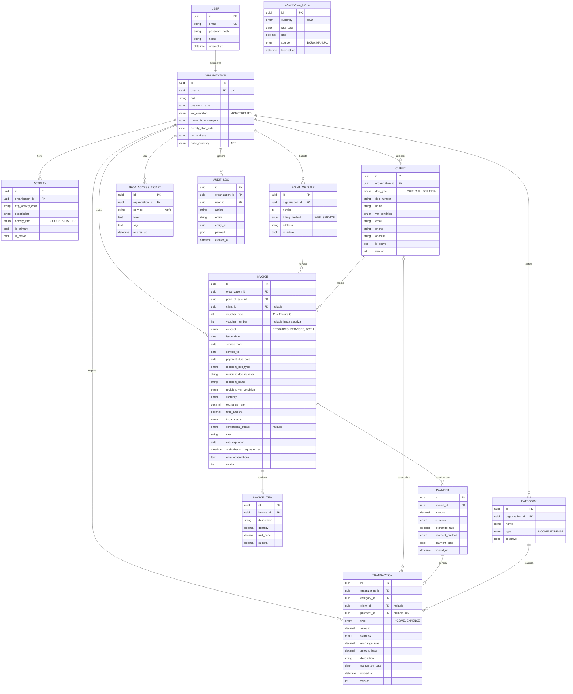

# Modelo de datos

Este documento corrige y completa el [DER inicial](./img/der-inicial.png) que presentamos en la primera entrega. El diagrama de abajo está hecho en Mermaid, así que GitHub lo dibuja solo y lo podemos ir modificando como texto junto con el código. El esquema real que usa el backend está en [`backend/prisma/schema.prisma`](../backend/prisma/schema.prisma) y tiene que coincidir con lo que dice acá.

Las entidades que pidió la cátedra para esta instancia (Organization, Client, Transaction, Invoice, InvoiceItem y Payment) están todas, junto con las que necesitamos para que funcione la facturación con ARCA.

## Qué cambiamos respecto del DER inicial

Al revisar el primer DER contra las reglas de negocio y contra lo que pide ARCA para emitir una Factura C, encontramos varias cosas que no cerraban:

1. **Payment y Transaction.** En el primer diagrama un pago podía tener muchos movimientos. La regla que definimos es que cada pago genera como máximo un movimiento de ingreso, así que la relación pasa a ser de uno a cero o uno. `Transaction.payment_id` es opcional (los movimientos cargados a mano no vienen de un pago) y único.
2. **Transaction.** Le faltaba el tipo de cambio usado (RN-05, RF-17). Le agregamos `exchange_rate`, `amount_base` (el importe convertido a la moneda base, para que el dashboard no tenga que recalcular), `client_id` para el historial por cliente, `description`, y `voided_at` para poder anular sin borrar.
3. **Estado de la factura.** Teníamos un solo campo `status`, pero la propuesta separa el estado fiscal (lo que dice ARCA) del comercial (si se cobró o no). Ahora son dos campos: `fiscal_status` y `commercial_status`.
4. **Datos que pide ARCA.** Para autorizar una Factura C hace falta el tipo y número de documento del receptor, su condición frente al IVA y, si la factura es de servicios, las fechas del servicio y del vencimiento del pago. Los agregamos a Invoice como una copia (snapshot) de los datos del cliente al momento de facturar.
5. **Payment.** Le sumamos moneda, tipo de cambio, medio de pago y `voided_at`.
6. **ExchangeRate.** En el primer DER dependía de la organización, pero la cotización del BCRA es la misma para todos. Ahora es una tabla global.
7. **Organization y Client.** A Organization le faltaban los datos fiscales que van impresos en la factura (condición frente al IVA, categoría de monotributo, inicio de actividades, domicilio). A Client, el contacto y el domicilio que ya mencionábamos en la propuesta.
8. **Tablas nuevas.** `ArcaAccessTicket` para guardar el ticket de acceso de WSAA, `IdempotencyKey` para que un reintento no duplique un pago o una emisión, y `AuditLog`, que ya estaba en el modelo conceptual pero no en el diagrama.

Los motivos de varios de estos cambios (sobre todo los estados, las versiones y los índices únicos) están explicados en [Atomicidad y concurrencia](./02-atomicidad-concurrencia.md).

## Diagrama

`IdempotencyKey` no aparece en el diagrama porque es una tabla técnica sin relaciones de negocio.

## Diccionario de datos

Para no repetir, en todas las tablas `id` es un UUID generado por la base, y `created_at` y `updated_at` se completan solos. Los importes son `numeric(14,2)` y los tipos de cambio `numeric(18,6)`: nunca usamos `float` para plata.

### User

| Campo | Tipo | Nulo | Descripción |
| --- | --- | --- | --- |
| email | varchar(255) | no | Único. Es el usuario para iniciar sesión. |
| password_hash | varchar(255) | no | Hash con Argon2 o bcrypt (RNF-02). Nunca guardamos la contraseña. |
| name | varchar(120) | no | Nombre para mostrar. |

### Organization

Por ahora cada usuario tiene una sola organización (su actividad como monotributista), por eso `user_id` es único.

| Campo | Tipo | Nulo | Descripción |
| --- | --- | --- | --- |
| user_id | uuid | no | Dueño de la organización. Único. |
| cuit | char(11) | no | CUIT sin guiones. Se valida el dígito verificador. |
| business_name | varchar(200) | no | Razón social o nombre y apellido. |
| vat_condition | enum | no | Para el P0 siempre `MONOTRIBUTO`. |
| monotributo_category | varchar(2) | sí | Categoría (A a K). Informativo. |
| activity_start_date | date | no | Inicio de actividades. Va impreso en la factura. |
| tax_address | varchar(255) | no | Domicilio fiscal. Va impreso en la factura. |
| base_currency | enum | no | Moneda en la que se muestran los totales. Por defecto `ARS` (RF-06). |

### Activity

| Campo | Tipo | Nulo | Descripción |
| --- | --- | --- | --- |
| organization_id | uuid | no | Organización dueña. |
| afip_activity_code | varchar(6) | no | Código de actividad según el nomenclador de ARCA. |
| description | varchar(255) | no | Descripción de la actividad. |
| activity_kind | enum | no | `GOODS` o `SERVICES`. Sirve para sugerir el concepto de la factura. |
| is_primary | boolean | no | Marca la actividad principal. Solo una por organización. |
| is_active | boolean | no | Baja lógica. |

### PointOfSale

| Campo | Tipo | Nulo | Descripción |
| --- | --- | --- | --- |
| organization_id | uuid | no | Organización dueña. |
| number | int | no | Número de punto de venta dado de alta en ARCA. Único por organización. |
| billing_method | enum | no | Para el P0, `WEB_SERVICE` (el punto de venta tiene que estar habilitado para factura electrónica por web service). |
| address | varchar(255) | sí | Domicilio del punto de venta. |
| is_active | boolean | no | Baja lógica. |

### Client

| Campo | Tipo | Nulo | Descripción |
| --- | --- | --- | --- |
| organization_id | uuid | no | Organización dueña (RNF-04). |
| doc_type | enum | no | `CUIT`, `CUIL`, `DNI` o `FINAL` (consumidor final sin identificar). |
| doc_number | varchar(11) | sí | Nulo solo si es consumidor final. Único por organización y tipo. |
| name | varchar(200) | no | Nombre o razón social. |
| vat_condition | enum | no | Condición frente al IVA (responsable inscripto, monotributo, exento, consumidor final). |
| email, phone | varchar | sí | Contacto. |
| address | varchar(255) | sí | Domicilio. |
| is_active | boolean | no | Baja lógica (RN-12). |
| version | int | no | Control de edición concurrente. |

### Category

| Campo | Tipo | Nulo | Descripción |
| --- | --- | --- | --- |
| organization_id | uuid | no | Organización dueña. |
| name | varchar(80) | no | Único por organización y tipo. |
| type | enum | no | `INCOME` o `EXPENSE`. Un movimiento solo puede usar una categoría de su mismo tipo. |
| is_active | boolean | no | Baja lógica. |

### ExchangeRate

| Campo | Tipo | Nulo | Descripción |
| --- | --- | --- | --- |
| currency | enum | no | Moneda cotizada. En el P0, `USD`. |
| rate_date | date | no | Día al que corresponde la cotización. |
| rate | numeric(18,6) | no | Pesos por unidad de moneda extranjera. |
| source | enum | no | `BCRA` o `MANUAL`. |
| fetched_at | timestamptz | no | Cuándo la consultamos (RN-13). |

Índice único en `(currency, rate_date, source)`. Cómo elegimos la cotización está en [Cotización](./05-cotizacion.md).

### Invoice

| Campo | Tipo | Nulo | Descripción |
| --- | --- | --- | --- |
| organization_id | uuid | no | Emisor. |
| point_of_sale_id | uuid | no | Punto de venta con el que se numera. |
| client_id | uuid | sí | Cliente, si está cargado. Puede ser nulo en una venta a consumidor final. |
| voucher_type | smallint | no | Código de ARCA. Para el P0, `11` (Factura C). |
| voucher_number | int | sí | Lo asignamos recién al autorizar. Único por organización, punto de venta y tipo. |
| concept | enum | no | `PRODUCTS`, `SERVICES` o `BOTH` (1, 2 y 3 en ARCA). |
| issue_date | date | no | Fecha del comprobante. |
| service_from, service_to, payment_due_date | date | sí | Obligatorios si el concepto incluye servicios. |
| recipient_doc_type, recipient_doc_number, recipient_name, recipient_vat_condition | varios | no | Copia de los datos del cliente al momento de facturar. Si después se edita el cliente, la factura no cambia. |
| currency | enum | no | En el P0 siempre `ARS`. |
| exchange_rate | numeric(18,6) | no | `1` para pesos. |
| total_amount | numeric(14,2) | no | Suma de los subtotales. Lo calcula el backend, no se acepta del frontend (RF-23). |
| fiscal_status | enum | no | `DRAFT`, `PENDING_AUTHORIZATION`, `AUTHORIZED` o `REJECTED`. |
| commercial_status | enum | sí | `PENDING`, `PARTIALLY_PAID` o `PAID`. Nulo mientras la factura no está autorizada. |
| cae, cae_expiration | varchar(14), date | sí | Solo si está autorizada (RN-09). |
| authorization_requested_at | timestamptz | sí | Cuándo se pidió la autorización. Lo usa la reconciliación. |
| arca_observations | text | sí | Errores u observaciones que devolvió ARCA. |
| version | int | no | Control de edición concurrente. |

### InvoiceItem

| Campo | Tipo | Nulo | Descripción |
| --- | --- | --- | --- |
| invoice_id | uuid | no | Factura a la que pertenece. Toda factura tiene al menos un ítem (RN-07). |
| description | varchar(255) | no | Producto o servicio. |
| quantity | numeric(12,3) | no | Mayor a cero. |
| unit_price | numeric(14,2) | no | Mayor o igual a cero. |
| subtotal | numeric(14,2) | no | `quantity * unit_price`, redondeado a dos decimales. |

### Payment

| Campo | Tipo | Nulo | Descripción |
| --- | --- | --- | --- |
| invoice_id | uuid | no | Factura que se cobra. Tiene que estar autorizada. |
| amount | numeric(14,2) | no | Mayor a cero. La suma de pagos no anulados no puede superar el total. |
| currency, exchange_rate | enum, numeric | no | En el P0 coinciden con los de la factura. |
| payment_method | enum | no | `CASH`, `TRANSFER`, `CARD`, `MERCADO_PAGO`, `OTHER`. |
| payment_date | date | no | Día en que se cobró. Es la fecha que cuenta para la caja. |
| voided_at | timestamptz | sí | Si tiene fecha, el pago está anulado y no cuenta. |

### Transaction

| Campo | Tipo | Nulo | Descripción |
| --- | --- | --- | --- |
| organization_id | uuid | no | Organización (RN-01). |
| category_id | uuid | no | Categoría del mismo tipo que el movimiento. |
| client_id | uuid | sí | Cliente asociado, si corresponde. |
| payment_id | uuid | sí | Si el movimiento viene de un cobro. Único. |
| type | enum | no | `INCOME` o `EXPENSE` (RN-02). |
| amount | numeric(14,2) | no | Mayor a cero (RN-03). |
| currency | enum | no | Obligatoria (RN-04). |
| exchange_rate | numeric(18,6) | no | `1` si la moneda es la base. Copia del valor usado, no una referencia (RN-05, RN-06). |
| amount_base | numeric(14,2) | no | `amount * exchange_rate`. Es lo que suma el dashboard. |
| description | varchar(255) | sí | Detalle libre. |
| transaction_date | date | no | Fecha del movimiento. |
| voided_at | timestamptz | sí | Anulación lógica. |
| version | int | no | Control de edición concurrente. |

### ArcaAccessTicket

| Campo | Tipo | Nulo | Descripción |
| --- | --- | --- | --- |
| organization_id | uuid | no | Organización dueña del certificado. |
| service | varchar(20) | no | Servicio de ARCA, por ahora `wsfe`. Único junto con la organización. |
| token, sign | text | no | Credenciales que devuelve WSAA. No se loguean ni se mandan al frontend. |
| expires_at | timestamptz | no | Vencimiento del ticket (unas 12 horas). |

### AuditLog

| Campo | Tipo | Nulo | Descripción |
| --- | --- | --- | --- |
| organization_id | uuid | no | Organización. |
| user_id | uuid | sí | Quién hizo la acción. Nulo si fue un proceso automático. |
| action | varchar(50) | no | Por ejemplo `LOGIN`, `INVOICE_AUTHORIZED`, `PAYMENT_CREATED`. |
| entity, entity_id | varchar, uuid | sí | Qué registro se tocó. |
| payload | jsonb | sí | Datos relevantes del evento, sin contraseñas ni tokens. |

### IdempotencyKey

| Campo | Tipo | Nulo | Descripción |
| --- | --- | --- | --- |
| organization_id | uuid | no | Organización. |
| key | varchar(64) | no | Valor del encabezado `Idempotency-Key`. Clave primaria junto con la organización. |
| endpoint | varchar(100) | no | Ruta a la que se aplicó. |
| response_status, response_body | int, jsonb | sí | Respuesta guardada para devolver lo mismo si llega un reintento. |
