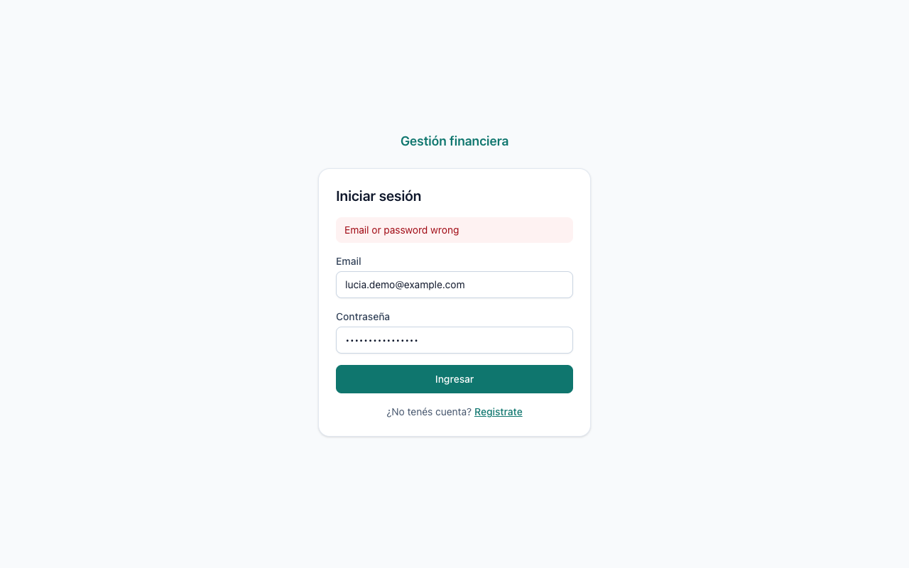
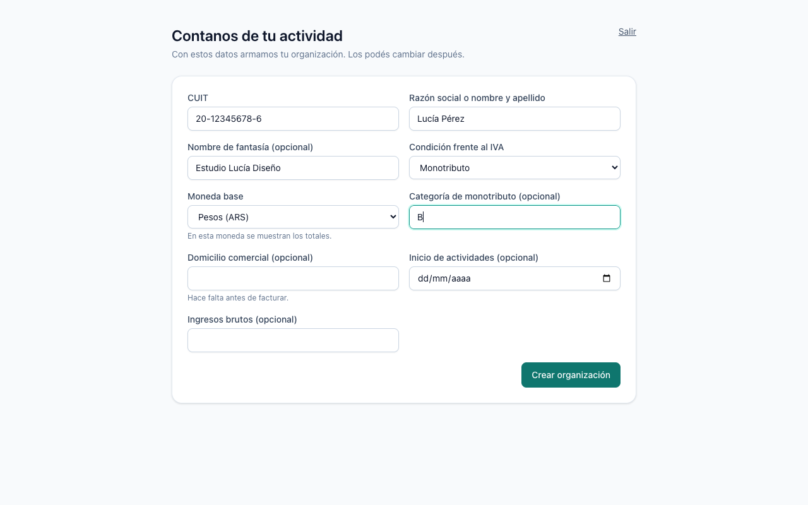
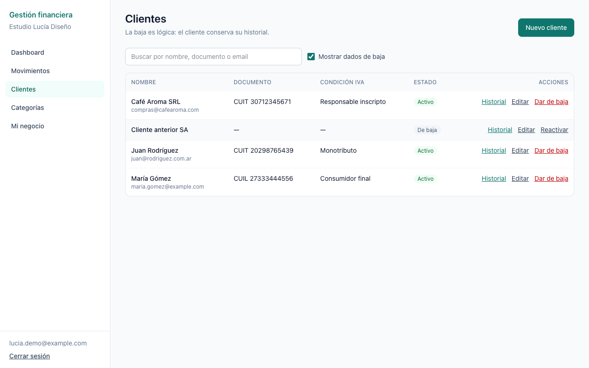
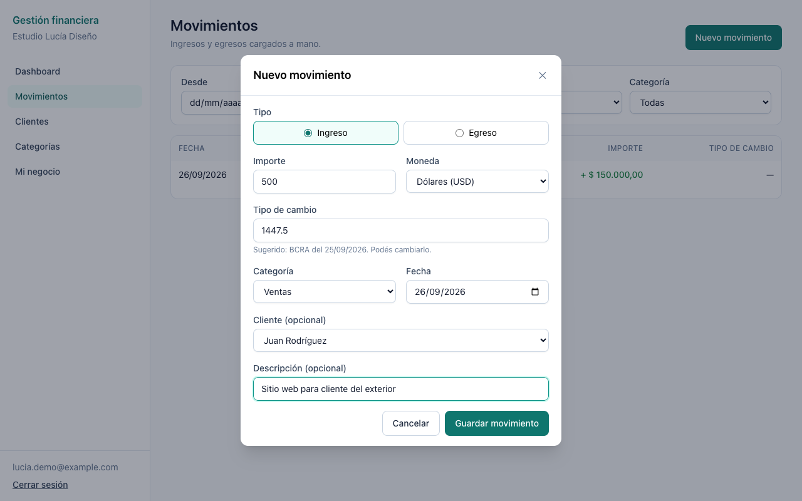
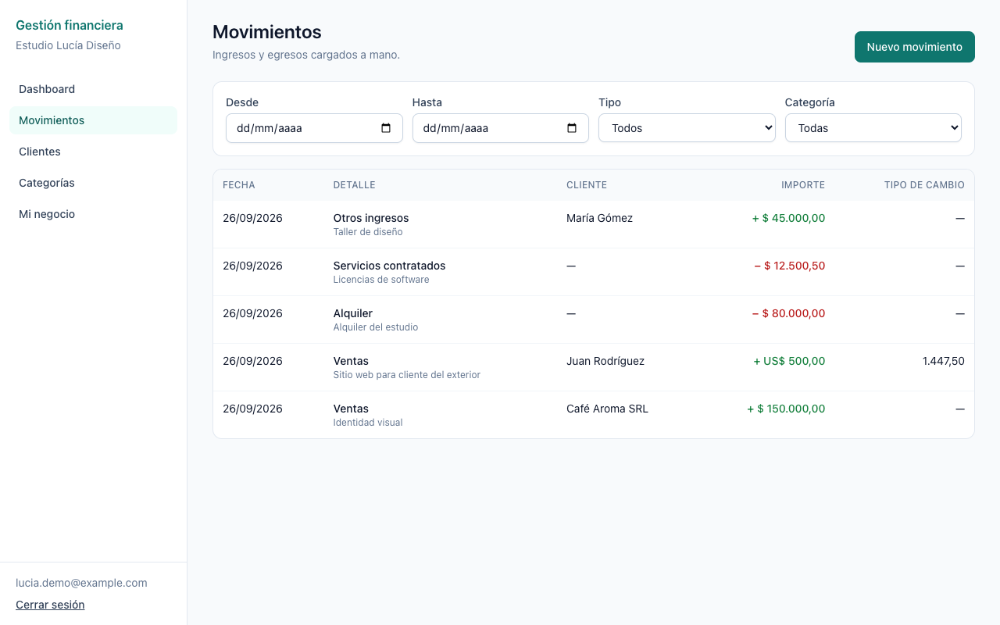
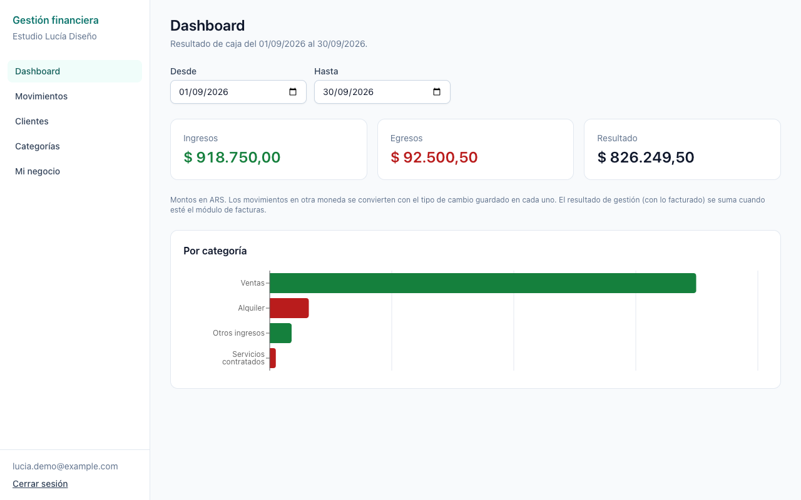
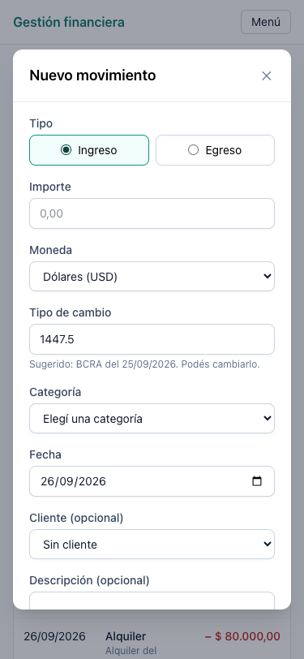
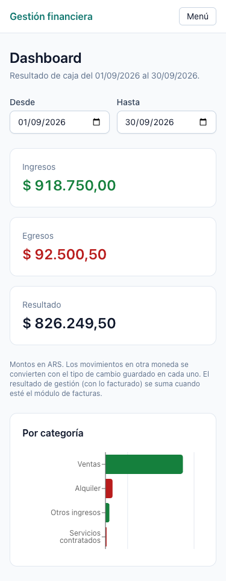

# Frontend

Aplicación web del TFI: React 19, TypeScript, Vite, Tailwind CSS, React Router, TanStack Query, React Hook Form con Zod y Recharts.

Cubre el recorrido de la segunda entrega: registro e inicio de sesión, onboarding de la organización, clientes, categorías, movimientos y dashboard.

## Requisitos

- Node 22.22 o superior. React Router 8 no funciona con versiones anteriores. En la raíz del repo hay un `.nvmrc`, así que alcanza con `nvm use`.
- pnpm 10.33, la misma versión que usa el backend. Si tenés Corepack activado (`corepack enable`), se instala solo al correr cualquier comando.
- El backend corriendo, para registrarse e iniciar sesión (ver `backend/`).

## Cómo levantarlo

Desde la raíz del repo:

```bash
pnpm install
pnpm dev
```

La app queda en http://localhost:5173. Para usar los mocks, creá `frontend/.env.local` con las variables de la tabla de abajo, por ejemplo:

```text
VITE_API_URL=http://localhost:3000
VITE_USE_MOCKS=true
```

Otros comandos, también desde la raíz (o desde `frontend/` sin el filtro):

| Comando                         | Qué hace                                                  |
| ------------------------------- | --------------------------------------------------------- |
| `pnpm lint`                     | ESLint                                                    |
| `pnpm test`                     | Tests con Vitest                                          |
| `pnpm build`                    | Chequeo de tipos y build de producción en `frontend/dist` |
| `pnpm --filter frontend format` | Formatea con Prettier                                     |

## Variables de entorno

| Variable         | Default                 | Para qué                                                              |
| ---------------- | ----------------------- | --------------------------------------------------------------------- |
| `VITE_API_URL`   | `http://localhost:3000` | URL del backend, sin `/api` al final.                                 |
| `VITE_USE_MOCKS` | vacío                   | Con `true`, se simulan los endpoints que el backend todavía no tiene. |

Las variables `VITE_*` quedan dentro del bundle que se publica, así que nunca pongas ahí secretos.

## Mocks

Hoy el backend solo tiene autenticación. Para no frenar las pantallas, simulamos el resto con [MSW](https://mswjs.io/), que intercepta los pedidos en el navegador. El contrato que siguen los mocks está en [`docs/08-contrato-api.md`](../docs/08-contrato-api.md).

- Se prenden con `VITE_USE_MOCKS=true`. Sin esa variable, el código de los mocks no entra en el bundle. Solo se copia `public/mockServiceWorker.js`, que no hace nada si nadie lo registra.
- Registro e inicio de sesión van siempre al backend real.
- `GET /api/auth/me` también va al backend real. Lo único que agrega el mock es la organización cuando el backend devuelve `null`, porque la organización todavía existe solo en los mocks. Ese handler está en `src/mocks/handlers/me-overlay.ts` y se borra cuando el backend tenga `POST /api/organizations`.
- Los datos simulados se guardan en el `localStorage` del navegador (`tfi.mocks.db`), así sobreviven a una recarga. Para empezar de cero, borrá esa clave.
- Las pantallas y los `features/*/api.ts` no saben si hay mocks: llaman a la misma URL en los dos casos.
- Los tests usan los mismos handlers, más una copia de los de auth (`src/mocks/handlers/auth.ts`), porque en los tests no hay backend.

Cuando el backend implemente un endpoint, se borra su handler de `src/mocks/handlers/` y listo.

## Estructura

```text
src/
├── app/            router, guardas de rutas, QueryClient y layout con la navegación
├── features/       un módulo por carpeta, con los mismos nombres que el backend
│   ├── auth/           registro, login y sesión
│   ├── organizations/  onboarding y "Mi negocio"
│   ├── clients/
│   ├── categories/
│   ├── transactions/
│   └── dashboard/
├── components/ui/  botón, input, select, tabla, modal y estados de carga, vacío y error
├── lib/            cliente HTTP, sesión y formato de moneda y fecha
├── mocks/          handlers de MSW y datos simulados
└── test/           setup de Vitest y helpers
```

Cada módulo de `features/` tiene:

- `api.ts`: las llamadas a la API, sin nada de React.
- `queries.ts`: los hooks de TanStack Query y la fábrica de query keys del módulo. Cada mutación invalida las keys que afecta.
- `schemas.ts`: los tipos y los esquemas de Zod de los formularios.
- Las páginas y los componentes del módulo.

## Rutas

| Ruta                                                             | Acceso                                                           |
| ---------------------------------------------------------------- | ---------------------------------------------------------------- |
| `/login`, `/registro`                                            | Públicas. Si ya hay sesión, redirigen a la app.                  |
| `/onboarding`                                                    | Solo para usuarios logueados que todavía no tienen organización. |
| `/`, `/movimientos`, `/clientes`, `/categorias`, `/organizacion` | Usuarios logueados con organización.                             |

Las guardas son loaders de React Router (`src/app/guards.ts`). Consultan `GET /api/auth/me`: sin token mandan al login, y si `organization` viene en `null` mandan a `/onboarding`. Cada página se carga de forma diferida, y Recharts viaja solo en el chunk del dashboard.

## Sesión

- El backend devuelve el JWT en el cuerpo de la respuesta. Lo guardamos en memoria y en `localStorage`, para que la sesión sobreviva a una recarga.
- Al abrir la app, la guarda valida el token con `GET /api/auth/me`.
- `src/lib/api.ts` agrega `Authorization: Bearer <token>` a cada pedido. Si un pedido con token recibe un `401`, cierra la sesión y vuelve al login.
- Cerrar sesión borra el token y limpia toda la caché de TanStack Query.

**Pendiente:** guardar el token en `localStorage` lo deja expuesto si alguna vez entra un script malicioso (XSS). Más adelante conviene pasarlo a una cookie `httpOnly`, `Secure` y `SameSite`. Eso requiere cambios en el backend: que el login setee la cookie, que el middleware la lea, un endpoint de logout y CORS con `credentials`.

## Reglas de negocio en el front

- Los importes llegan como string decimal (`"1500.50"`). El front los formatea para mostrarlos, pero no suma ni convierte plata: los totales los calcula el backend (o el mock).
- Movimientos: importe mayor a cero, moneda obligatoria y categoría del mismo tipo que el movimiento. Si la moneda no es la base, se pide el tipo de cambio. Para dólares se sugiere la cotización del día y se puede editar.
- Clientes: la baja es lógica. Los clientes dados de baja se ocultan por defecto y se ven con el filtro "Mostrar dados de baja".

## Despliegue

`public/_redirects` le indica a Cloudflare Pages que sirva `index.html` en cualquier ruta, así no da 404 al recargar `/movimientos`.

## Capturas

|                                                                                   |                                                                                                 |
| --------------------------------------------------------------------------------- | ----------------------------------------------------------------------------------------------- |
|               |                                            |
|             |  |
|                            |                                              |
|  |                          |
